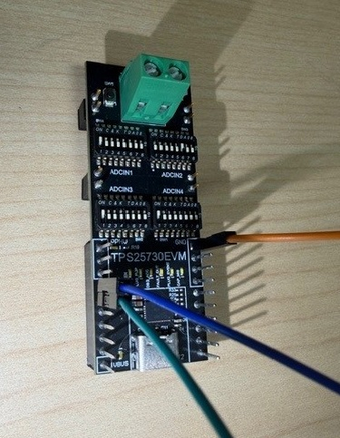
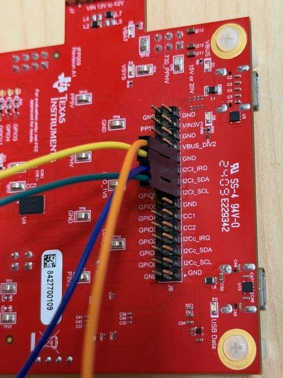
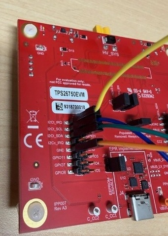

<picture>
  <source media="(prefers-color-scheme: dark)" srcset="https://www.ti.com/content/dam/ticom/images/identities/ti-brand/ti-logo-hz-1c-white.svg" width="300">
  
</picture>

# USB-PD Code Examples

Collection of MCU code examples to be used with Texas Instruments' USB-PD controllers.

[Summary](#summary) | [Supported Devices](#supported-devices) | [Build Instructions](#build-instructions) | [Header Files](#header-files) |[Licensing](#licensing) | [Contributions](#contributions) | [Developer Resources](developer-resources)

</div>

## Summary

The code examples in the repository are meant to serve as a reference for interfacing from various microcontrollers with the host interface (via I2C) for Texas Instruments USB-PD controllers. While the examples in this repository are not intended to be "turn-key" solutions for a complete software implementation, they are meant to showcase the flexibility and configurability of TI USB-PD solutions and serve as a starting point for  more complete software systems. 

## Supported Devices

- [**TPS25730**](https://www.ti.com/product/TPS25730) - Sink-only USB Type-C® and USB Power Delivery (PD) controller with no firmware development required

- **[TPS25751](https://www.ti.com/product/TPS25751)** - USB-C® Power Delivery 3.2 controller with moisture detection and programmable power-supply

- [**TPS26750**](https://www.ti.com/product/TPS26750) - USB Type-C® and USB Power Delivery (PD) 3.2 controller with 240W extended power-range support

The majority of the code examples will leverage communication using the host interface of the USB-PD controllers listed above (over I2C). To interact with the host interface, simple jumper wire can be used to connect the EVM of the corresponding MCU to the EVM of the USB-PD controller.  Each USB-PD controller will have the I2C signals of the host interface brought out to a specific header. Examples of how to do this can be seen below.

Note that in the pictures below, the blue wire represents the I2C SDA line and the green wire represents the I2C SCL line (with black being ground).

##### **[TPS25730EVM](https://www.ti.com/tool/TPS25730EVM)**



##### [TPS25751EVM](https://www.ti.com/tool/TPS25751EVM)



##### [TPS26750EVM](https://www.ti.com/tool/TPS26750EVM)



## Build Instructions

Each code example is built  with the corresponding IDE of the MCU that it is supporting.   Currently, the following MCU architectures are supported.

- **[Texas Instruments MSPM0G3507](https://www.ti.com/product/MSPM0G3507)** -  80MHz Arm® Cortex®-M0+ MCU with 128KB flash 32KB SRAM 2x4Msps ADC, DAC, 3xCOMP, 2xOPA, CAN-FD, MATHA

General explanations of how to build each example are listed below.

### [Texas Instruments MSPM0 Microcontrollers](https://www.ti.com/product-category/microcontrollers-processors/arm-based-mcus/arm-cortex-m0/overview.html)

For the TI MSPM0 family of microcontrollers, the code examples are provided with the [Code Composer Studio Theia](https://www.ti.com/tool/download/CCSTUDIO-THEIA) IDE. For these code examples it is required to have the relevant [MSPM0 SDK](https://www.ti.com/tool/MSPM0-SDK) installed and acessible to Code Composer. As most of these code examples will leverage FreeRTOS (not included in this repository), the project files will rely on the install of the MSPM0 SDK for driver dependancies, RTOS libraries, and build infrastructure. To import a project into the IDE, simply go to ***File->Import Project(s)*** and follow the prompts for importing the projects into you environment. 

## Header Files

For the majority of code examples listed in this repository, a corresponding header file that represent register structures and definitions are provided to simplify acessibility and programming. An example of such header file can be seen below:

```c
typedef union 
{
    uint32_t word;
    struct __attribute__((packed)) 
    {
        uint16_t operationalCurrent : 10;
        uint16_t operationalVoltage : 10;
        uint16_t reserved1          : 5;
        uint8_t  dualRoleData       : 1;
        uint8_t  reserved2          : 2;
        uint8_t  higherCapability   : 1;
        uint8_t  dualRolePower      : 1;
        uint8_t  supplyType         : 2;
    } bits;
} TI_USB_FIXED_PDO;
```

The purpose of this header file is to allow for the programmer to choose if they access individual bits or the greater primitive type. This enables flexibility of changing/modifying one bit without the need to mask out the bits that are not being modified. Note that these structs are required to be "packed" via a preprocessor directive to ensure correct data alignment.

## Licensing

See [LICENSE.md](https://github.com/TexasInstruments/usb-pd/blob/main/LICENSE)

## Contributions

This repository is not currently accepting community contributions.

---

## Developer Resources

[TI E2E™ design support forums](https://e2e.ti.com) | [Learn about software development at TI](https://www.ti.com/design-development/software-development.html) | [Training Academies](https://www.ti.com/design-development/ti-developer-zone.html#ti-developer-zone-tab-1) | [TI Developer Zone](https://dev.ti.com/)
