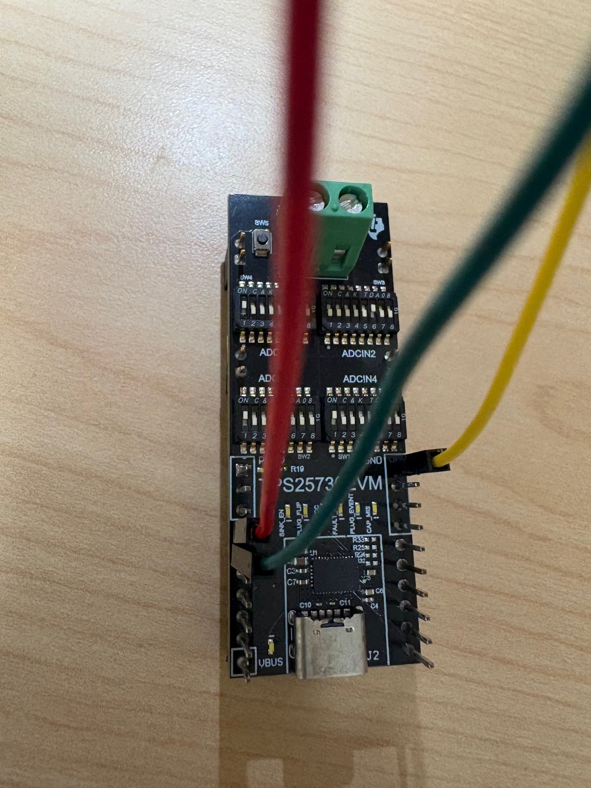

<picture>
  <source media="(prefers-color-scheme: dark)" srcset="https://www.ti.com/content/dam/ticom/images/identities/ti-brand/ti-logo-hz-1c-white.svg" width="300">
  
</picture>

# USB-PD Code Examples

Collection of MCU code examples to be used with Texas Instruments' USB-PD controllers.

[Summary](#summary) | [Supported Devices](#supported-devices) | [Build Instructions](#build-instructions) | [Header Files](#header-files) |[Licensing](#licensing) | [Contributions](#contributions) | [Developer Resources](developer-resources)

</div>

## Summary

The code examples in the repository are meant to serve as a reference for interfacing from various microcontrollers with the host interface (via I2C) for Texas Instruments USB-PD controllers. While the examples in this repository are not intended to be "turn-key" solutions for a complete software implementation, they are meant to showcase the flexibility and configurability of TI USB-PD solutions and serve as a starting point for  more complete software systems. 

## Supported Devices

- [**TPS25730**](https://www.ti.com/product/TPS25730) - Sink-only USB Type-C® and USB Power Delivery (PD) controller with no firmware development required

- **[TPS25751](https://www.ti.com/product/TPS25751)** - USB-C® Power Delivery 3.2 controller with moisture detection and programmable power-supply

- **[TPS25751A](https://www.ti.com/product/TPS25751A)** - USB-C® Power Delivery 3.2 controller with moisture detection and programmable power-supply

- [**TPS26750**](https://www.ti.com/product/TPS26750) - USB Type-C® and USB Power Delivery (PD) 3.2 controller with 240W extended power-range support

The majority of the code examples will leverage communication using the host interface of the USB-PD controllers listed above (over I2C). To interact with the host interface, simple jumper wire can be used to connect the EVM of the corresponding MCU to the EVM of the USB-PD controller.  Each USB-PD controller will have the I2C signals of the host interface brought out to a specific header.

Note that in the pictures below, the red wire represents the I2C SDA line and the green wire represents the I2C SCL line (with yellow being ground).

Note that J9 on the LP-MSPM0G3507 LaunchPad must be removed in order to avoid pin conflicts. 

##### **[TPS25730EVM](https://www.ti.com/tool/TPS25730EVM)**



An example using the TPS25751EVM can be seen below:

##### **[TPS25751EVM](https://www.ti.com/tool/TPS25730EVM)**


Note in this case the extra orange cable is for I2C interrupt.

##### **[TPS25751AEVM](https://www.ti.com/tool/TPS25751AEVM)**


In this configuration, the following connections are made:

- GND of the TPS25751A is connected to any available GND pin of the LP-MSPM0G3507

- I2Ct_SCL of the TPS25751A is connected to PB2 of the LP-MSPM0G3507

- I2Ct_SDA of the TPS25751A is connected to PB3 of the LP-MSPM0G3507

- I2Ct_IRQ of the TPS25751A is connected to PB24 of the LP-MSPM0G3507

## Build Instructions

Each code example is built  with the corresponding IDE of the MCU that it is supporting.   Currently, the following MCU architectures are supported.

- **[Texas Instruments MSPM0G3507](https://www.ti.com/product/MSPM0G3507)** -  80MHz Arm® Cortex®-M0+ MCU with 128KB flash 32KB SRAM 2x4Msps ADC, DAC, 3xCOMP, 2xOPA, CAN-FD, MATHA

General explanations of how to build each example are listed below.

### [Texas Instruments MSPM0 Microcontrollers](https://www.ti.com/product-category/microcontrollers-processors/arm-based-mcus/arm-cortex-m0/overview.html)

For the TI MSPM0 family of microcontrollers, the code examples are provided with the [Code Composer Studio](https://www.ti.com/tool/download/CCSTUDIO) IDE. For these code examples it is required to have the relevant [MSPM0 SDK](https://www.ti.com/tool/MSPM0-SDK) installed and acessible to Code Composer. As most of these code examples will leverage FreeRTOS (not included in this repository), the project files will rely on the install of the MSPM0 SDK for driver dependancies, RTOS libraries, and build infrastructure. To import a project into the IDE, simply go to ***File->Import Project(s)*** and follow the prompts for importing the projects into you environment. 

## Header Files

For the majority of code examples listed in this repository, a corresponding header file that represent register structures and definitions are provided to simplify accessibility and programming. An example of such header file can be seen below:

This code example takes the register structures of the TPS25751A's host interface (as described in the [TPS25751A Technical Reference Manual](https://www.ti.com/lit/pdf/SPMU379)) and represents them in a standard C header file. The interrupt event register, for example:


... is mapped pragmatically to a header file as seen below from **[tps25751.h](https://github.com/TexasInstruments/usb-pd/blob/main/common/tps25751.h)**:

```c
/* Interrupt Event Register */
typedef union
{
    uint8_t bytes[12];
    struct __attribute__((packed))  
    {
        uint8_t  numOfBytes         : 8;
        uint8_t  reserved0          : 1;
        uint8_t  pdHardReset        : 1;
        uint8_t  reserved1          : 1;
        uint8_t  plugInsertRemoval  : 1;
        uint8_t  powerSwapComplete  : 1;
        uint8_t  dataSwapComplete   : 1;
        uint8_t  reserved2          : 1;
        uint8_t  reserved3          : 1;
        uint8_t  reserved4          : 1;
        uint8_t  overcurrent        : 1;
        uint8_t  reserved5          : 1;
        uint8_t  reserved6          : 1;
        uint8_t  newContractCons    : 1;
        uint8_t  newContractProv    : 1;
        uint8_t  sourceCapRec       : 1;
        uint8_t  sinkCapRec         : 1;
        uint8_t  reserved7          : 1;
        uint8_t  powerSwapReq       : 1;
        uint8_t  dataswapReq        : 1;
        uint8_t  reserved8          : 1;
        uint8_t  usbHostPresent     : 1;
        uint8_t  usbHostNotPresent  : 1;
        uint8_t  reserved9          : 1;
        uint8_t  pwrPathSwChanged   : 1;
        uint8_t  powerStatUpdate    : 1;
        uint8_t  reserved10         : 1;
        uint8_t  statusUpdate       : 1;
        uint8_t  pdStatusUpdate     : 1;
        uint8_t  reserved11         : 2;
        uint8_t  cmd1Complete       : 1;
        uint8_t  reserved12         : 1;
        uint8_t  devIncompError     : 1;
        uint8_t  cannotProvVolCur   : 1;
        uint8_t  canProvVolCurLtr   : 1;
        uint8_t  powerEvent         : 1;
        uint8_t  missingGetCaps     : 1;
        uint8_t  reserved13         : 1;
        uint8_t  protocolError      : 1;
        uint8_t  msgDataError       : 1;
        uint8_t  reserved14         : 2;
        uint8_t  sinkTransComplete  : 1;
        uint8_t  plugEarlyNotf      : 1;
        uint8_t  reserved15         : 2;
        uint8_t  unableToSource     : 1;
        uint16_t  reserved16        : 9;
        uint8_t  extDCDCSinkSafe    : 1;
        uint8_t  extDCDCSourceSafe  : 1;
        uint8_t  reserved17         : 2;
        uint8_t  liquidDetect       : 1;
        uint8_t  reserved18         : 4;
        uint8_t  txMemBuffEmpty     : 1;
        uint8_t  mbrdBuffReady      : 1;
        uint16_t  reserved19        : 13;
        uint8_t  patchLoaded        : 1;
        uint8_t  rdyForPatch        : 1;
        uint8_t  i2cConNacked       : 1;
        uint8_t  reserved20         : 5;
    } bits;
} tIntEventRegister;
```

Using these header files, this code example keeps a "shadow" copy of the device's configuration in RAM and shows how to keep track of the device's interrupt events registers.

## Portability Layer

While the majority of examples in this repository were created to work with the [Texas Instruments MSPM0G3507](https://www.ti.com/product/MSPM0G3507)**, a portability layer exists to allow the code examples to be run on any microcontroller/processor system. This is done by abstracting out any specific hardware/RTOS calls to a small, lightweight "portability layer". The portability functions that need to be implemented to support new MCU architectures are documented in the [tps_usbpd_i2c_driver.h](./common/tps_usbpd_i2c_driver.h)** file.

## Licensing

See [LICENSE.md](https://github.com/TexasInstruments/usb-pd/blob/main/LICENSE)

## Contributions

This repository is not currently accepting community contributions.

---

## Developer Resources

[TI E2E™ design support forums](https://e2e.ti.com) | [Learn about software development at TI](https://www.ti.com/design-development/software-development.html) | [Training Academies](https://www.ti.com/design-development/ti-developer-zone.html#ti-developer-zone-tab-1) | [TI Developer Zone](https://dev.ti.com/)
