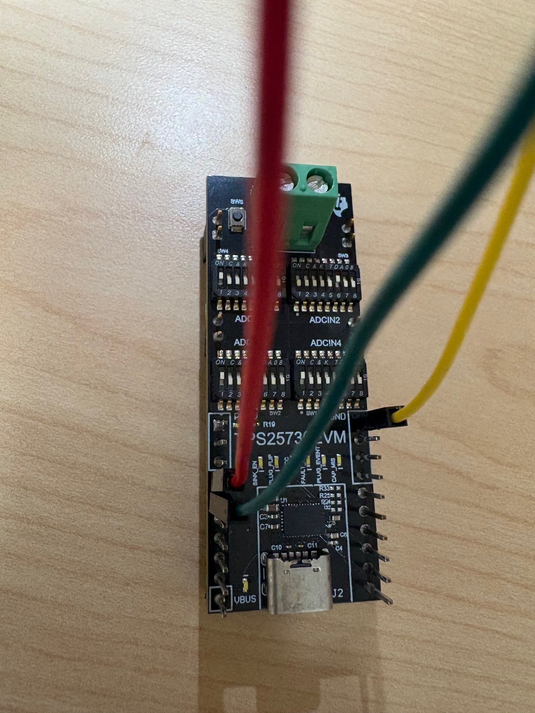
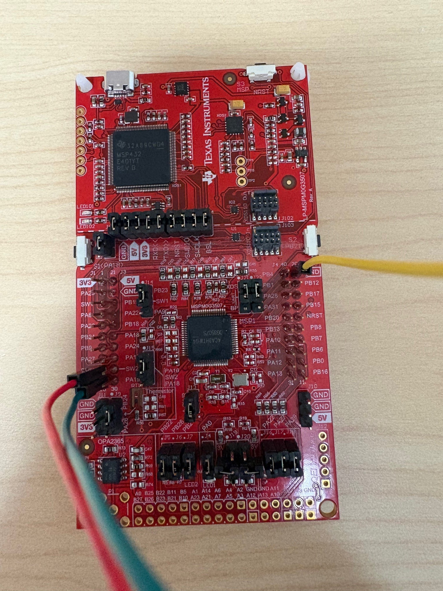
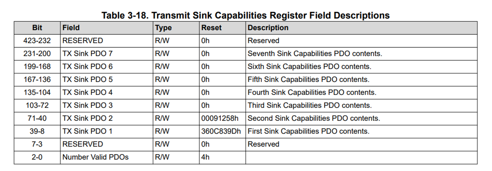
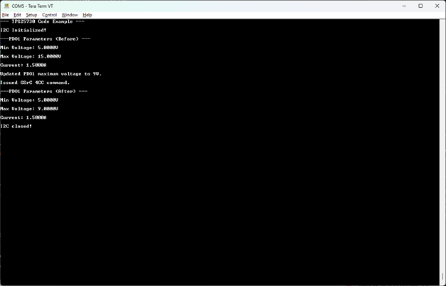
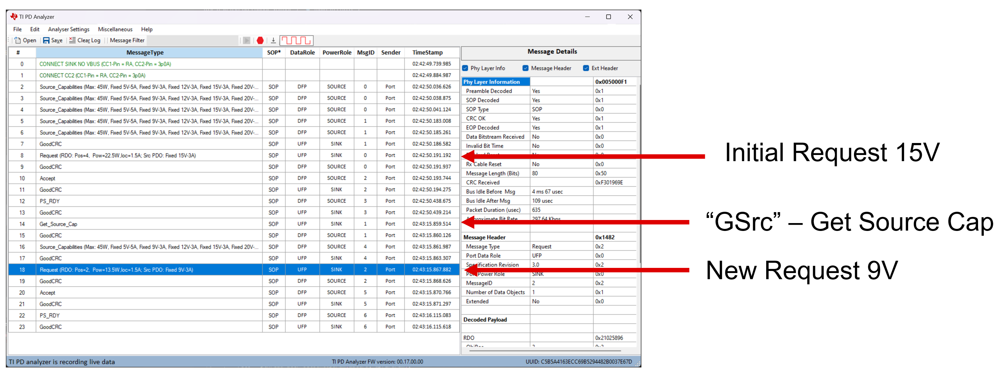

<picture>
  <source media="(prefers-color-scheme: dark)" srcset="https://www.ti.com/content/dam/ticom/images/identities/ti-brand/ti-logo-hz-1c-white.svg" width="300">
  
</picture>

# TPS25730 PDO Re-Negotiation Example

## Summary

This code example shows how to force a re-negotiation of a PDO on a USB-PD sink device ([TPS25730](https://www.ti.com/product/TPS25730)). As the TPS25730 device is a simple sink device without any custom firmware configuration, this is done entirely using the I2C host interface and 4CC commands outlined in the [TPS25730 Technical User's Manual](https://www.ti.com/lit/pdf/slvucj7).

## Hardware Configuration

The [TPS25730EVM](https://www.ti.com/tool/TPS25730EVM) is used in conjunction with the [LP-MSPM0G3507 LaunchPad](https://www.ti.com/tool/LP-MSPM0G3507). The I2C lines are connected via jumper wire with the MSPM0G3507 being the I2C controller and the TPS25730 being the I2C peripheral device. The jumper configuration can be seen below:

##### **[TPS25730EVM](https://www.ti.com/tool/TPS25730EVM)**



**[LP-MSPM0G3507](https://www.ti.com/tool/LP-MSPM0G3507)**



In this configuration, the red wire is I2C data (SDA), the green wire is I2C clock (SCL), and the yellow wire is ground (GND). 

## Build Instructions

Please refer to the build instructions included in the root of the examples repository [README.md](https://github.com/TexasInstruments/usb-pd).

This code example was built using the [MSP M0 SDK](https://www.ti.com/tool/MSPM0-SDK) **v2_06_00_05** and [Code Composer Studio](https://www.ti.com/tool/CCSTUDIO) **v20.4.0.13**. This code example leverages TI-Drivers for UART logging and I2C communication as well as the FreeRTOS kernel included in the MSPM0 SDK.

## Usage

This code example takes the register structures of the TPS25730's host interface (as described in the [TPS25730 Technical User's Manual](https://www.ti.com/lit/pdf/slvucj7)) and represents them in a standard C header file. The sink capabilities register, for example:



... is mapped pragmatically to a header file as seen below from **[usb_pdo.h](./usb_pdo.h)**:

```c
/* Sink Capabilities Register */
typedef struct __attribute__((packed)) sSinkSourceCapabilities
{
    uint8_t              numOfBytes;
    uint8_t              numOfPDOs   :   3;
    uint8_t              reserved0   :   5;
    TI_USB_FIXED_PDO     fixedPDO;
    TI_USB_VARIABLE_PDO  sinkPDOs[6];
    uint8_t              reserved1[24];
} tSinkSourceCapabilities;
```

Using these header files, this code example keeps a "shadow" copy of the device's configuration in RAM and shows how to modify the requested PDO to a different voltage after initial negotiation. Initially, the jumper configuration of the TPS25730EVM is set to request a **15V/3A** PDO from the source device.  The first step of the application after boot is to read a copy of the sink capabilities into its local shadow structure:

```c
    /* Reading the PDOs initially */
    addrReg = TPS25730_SINK_CAP_REG;
    i2cTransaction.writeBuf   = &addrReg;
    i2cTransaction.writeCount = 1;
    i2cTransaction.readBuf    = &sinkCapabilities;
    i2cTransaction.readCount  = sizeof(sinkCapabilities);
    i2cTransaction.targetAddress = i2cTargetAddr;

    if (I2C_transfer(i2c, &i2cTransaction) == false)
    {
        Display_printf(display, 0, 0, "Error reading source PDOs\n");
        while (1)
        {
        }
    }
```

From here, the voltage is changed to 9V and the resulting structure is copied to a specific structure used for register writes to the TPS25730's host interface and sent to the TPS25730:

```c
    /* Changing the voltage to 9V (9/.05 = 180)*/
    sinkCapabilities.sinkPDOs[0].bits.maximumVoltage = 180;
    sinkReadPacket.writeAddr = TPS25730_SINK_CAP_REG;
    memcpy(&sinkReadPacket.sinkSourceCap, &sinkCapabilities, sizeof(tSinkSourceCapabilities));
    i2cTransaction.writeCount = sizeof(tSinkSourceCapabilities) + 1;
    i2cTransaction.writeBuf = &sinkReadPacket;
    i2cTransaction.readCount = 0;

    if (I2C_transfer(i2c, &i2cTransaction) == false)
    {
        Display_printf(display, 0, 0, "Error writing sink PDOs\n");
        while (1)
        {
        }
    }
```

From here, the 4cc gSrc command is issued which causes the source USB-PD device to force a re-negotiation using the updated 9V sink PDO:

```c
    /* Issuing the 4CC command to redo the source capabilities */
    i2cTransaction.writeBuf = (void*)&gSrcCommand;
    i2cTransaction.writeCount = sizeof(t4CCCommand);

    if (I2C_transfer(i2c, &i2cTransaction) == false)
    {
        Display_printf(display, 0, 0, "Error issuing 4CC command\n");
        while (1)
        {
        }
    }
```

As the gSrc command is a simple command with no parameters nor any readback data, the structure is a simple data representation of the ASCII value for gSrc as well as some header data:

```c
const t4CCCommand gSrcCommand = 
{
    .commandRegister = TPS25730_4CC_REG,
    .numOfBytes = 4,
    .fourCCBytes = {0x47, 0x53, 0x72, 0x43}
};
```

After re-negotiation, the sink capabilities PDO is re-read to confirm that the active contract is the new 9V contract. The output using the MSPM0G3507's serial output can be seen below:



The full sequence of events can be seen below (captured using the USB-PD-ANALYZER from TI):



## Licensing

See [LICENSE.md](https://github.com/TexasInstruments/usb-pd/blob/main/LICENSE)

---

## Developer Resources

[TI E2E™ design support forums](https://e2e.ti.com) | [Learn about software development at TI](https://www.ti.com/design-development/software-development.html) | [Training Academies](https://www.ti.com/design-development/ti-developer-zone.html#ti-developer-zone-tab-1) | [TI Developer Zone](https://dev.ti.com/)
