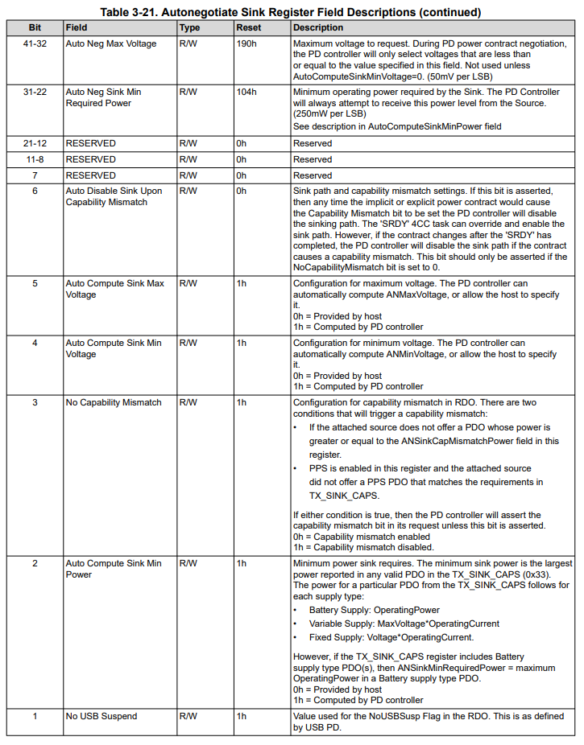
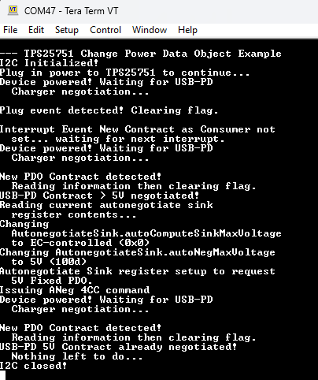
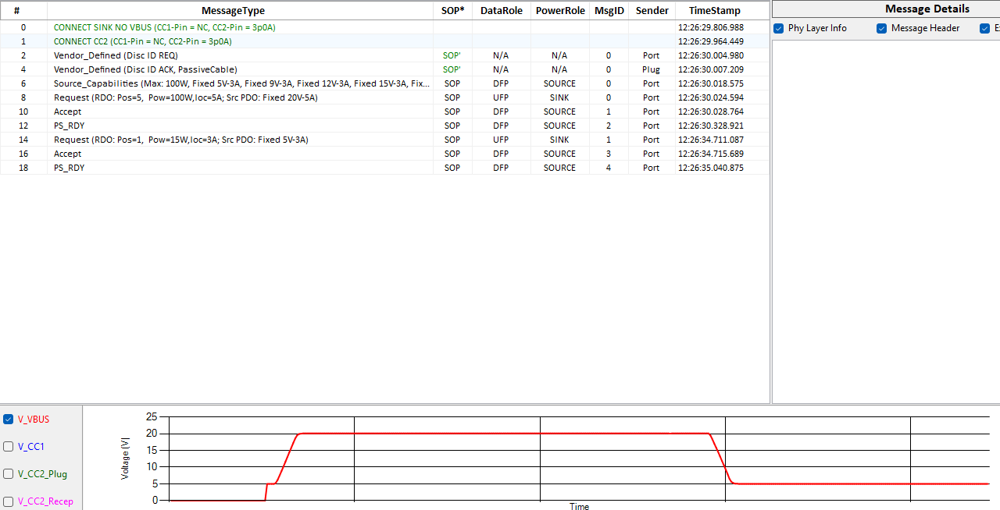

<picture>
  <source media="(prefers-color-scheme: dark)" srcset="https://www.ti.com/content/dam/ticom/images/identities/ti-brand/ti-logo-hz-1c-white.svg" width="300">
  
</picture>

# TPS25751 Change Power Data Object Example

## Summary

This code example shows how to utilize the Autonegotiate Sink and the 4CC command 'ANeg' to change power provided to the system when using the [TPS25751](https://www.ti.com/product/TPS25751). This is an interrupt-driven design and will utilize the I2Ct_IRQ to determine when power consumption has changed. The TPS25751 starts by consuming the maximum a power supply can provide (20V at 3A), The Requested Data Object (RDO) and Received Source Capabilites are read-back, Autonegotiate sink register is modified to have the TPS25751 negotiate a lower (5V) RDO, then the 4CC 'ANeg' command is sent. The interurpts are driven by the TPS25751 and sent to the MCU (in this case an [MSPM0G3507](https://www.ti.com/product/MSPM0G3507)) which will trigger different events depending on the interrupt events asserted.

## Hardware Configuration

The [TPS25751EVM](https://www.ti.com/tool/TPS25751EVM) is used in conjunction with the [LP-MSPM0G3507 LaunchPad](https://www.ti.com/tool/LP-MSPM0G3507). The I2C lines are connected via jumper wire with the MSPM0G3507 being the I2C controller and the TPS25751 being the I2C peripheral device. The jumper configuration can be seen below:

##### **[TPS25751EVM](https://www.ti.com/tool/TPS25751EVM)**


##### **[LP-MSPM0G3507](https://www.ti.com/tool/LP-MSPM0G3507)**


In this configuration, the red wire is I2C data (SDA), the green wire is I2C clock (SCL), the orange wire is I2C interrupt, and the yellow wire is ground (GND).  Also note that PB24 is used for I2C interrupts so the jumper J9 must be removed on the MSPM0 LaunchPad.

## Build Instructions

Please refer to the build instructions included in the root of the examples repository [README.md](https://github.com/TexasInstruments/usb-pd).

This code example was built using the [MSP M0 SDK](https://www.ti.com/tool/MSPM0-SDK) **v2_06_00_05** and [Code Composer Studio](https://www.ti.com/tool/CCSTUDIO) **v20.4.0.13**. This code example leverages TI-Drivers for UART logging and I2C communication as well as the FreeRTOS kernel included in the MSPM0 SDK.

Note that the device configuration file that is used to setup the TPS25751EVM has been checked into this repository in the [config.json](https://github.com/TexasInstruments/usb-pd/blob/main/examples/tps25751/mspm0g3507/tps25751_change_power_data_object/config.json) file. You can use this JSON file with the [USB Configuration Tool](https://dev.ti.com/gallery/view/USBPD/USBCPD_Application_Customization_Tool/) as described in the [TPS25751EVM's User's Guide](https://www.ti.com/lit/pdf/SLVUCP9).

## Usage

This code example takes the register structures of the TPS25751's host interface (as described in the [TPS25751 Technical User's Manual](https://www.ti.com/lit/pdf/slvucr8)) and represents them in a standard C header file. The boot flags register, for example:



... is mapped pragmatically to a header file as seen below from **[tps25751.h](https://github.com/TexasInstruments/usb-pd/blob/main/common/tps25751.h)**:

```c
/* Autonegotiate Sink Register */
typedef struct __attribute__((packed)) sAutonegotiateSinkRegister 
{
    uint8_t  numOfBytes                      : 8;
    uint8_t  autoNegRDOPriority              : 1;
    uint8_t  noUSBSusp                       : 1;
    uint8_t  autoComputeSinkMinPower         : 1;
    uint8_t  noCapabilityMismatch            : 1;
    uint8_t  autoComputeSinkMinVoltage       : 1;
    uint8_t  autoComputeSinkMaxVoltage       : 1;
    uint8_t  autoDisInputOnCapMistmatch      : 1;
    uint16_t  reserved0                      : 15;
    uint16_t  autoNegSinkMinRequiredPower    : 10;
    uint16_t  autoNegMaxVoltage              : 10;
    uint16_t  autoNegMinVoltage              : 10;
    uint16_t  autoNegCapMismatchPower        : 10;
    uint8_t  reserved1                       : 2;
    uint8_t  ppsEnableSinkMode               : 1;
    uint8_t  ppsRequestInterval              : 2;
    uint8_t  ppsSourceOperatingMode          : 1;
    uint8_t  ppsRequiredFullVoltageRange     : 1;
    uint8_t  ppsDisableSinkUponNonAPDOContract : 1;
    uint32_t  reserved2                      : 26;
    uint8_t  ppsOperatingCurrent             : 7;
    uint8_t  reserved3                       : 2;
    uint16_t  ppsOutputVoltage               : 11;
    uint32_t reserved4                       : 32;
    uint32_t reserved5                       : 32;
    uint32_t reserved6                       : 12;
} tAutonegotiateSinkRegister;
```

At any point during the flow of this code example if the auto negotiation sequence doesn't behave as expected, the program will close the I2C interface and end the program. 

Using these header files, this code example keeps a "shadow" copy of the device's configuration in RAM and shows how to keep track of the device's interrupt events register and autonegotiate sink register. In this code example, we setup the MSPM0 to poll the ***Mode Register (0x03)***. When a successful read is done of the register, the USB-PD device is up and running and the device can continue execution of the demo. 

In order to proceed to the next step, either plug in the USB cable to port ***J3*** on the TPS25751 and the power to port ***J2*** (Power to the system is optional but for this test, power is provided at start of example):

```c
    SYSTEM_POWER_ON:
    /* Waiting for USB-PD Source to be plugged in...  */
    Display_printf(display, 0, 0, "Plug in power to TPS25751 to continue...");
    vTaskDelay(500 / portTICK_PERIOD_MS);

    /* Setting up the read transaction to the event register */
    addrReg = TPS25751_MODE_REG;
    i2cTransaction.writeBuf   = &addrReg;
    i2cTransaction.writeCount = 1;
    i2cTransaction.readBuf    = &modeRegister.numOfBytes;
    i2cTransaction.readCount  = sizeof(tModeRegister);

    if (I2C_transfer(i2c, &i2cTransaction) == false)
    {
        Display_printf(display, 0, 0, "USB-PD not responding (NAK)");
        goto SYSTEM_POWER_ON;
    }
```

This is the main loop entry point for the example. When an interrupt occurs on the I2C IRQ line, the device attempts to read the ***Interrupt Event for I2C1 (0x14)*** and process the different potential events that are enabled:

```c
    WAIT_FOR_USBPD_CONTRACT:
    /* Waiting for USB-PD Source to be plugged in...  */
    Display_printf(display, 0, 0, "Device powered! Waiting for USB-PD");
    Display_printf(display, 0, 0, "  Charger negotiation...");
    // Only wait for IRQ if not already asserted. If IRQ is asserted, keep executing
    if (GPIO_read(CONFIG_GPIO_PD_IRQ))
    {
        do
        {
            xSemaphoreTake(xSemaphore, portMAX_DELAY);
            vTaskDelay(50 / portTICK_PERIOD_MS);
        } while (GPIO_read(CONFIG_GPIO_PD_IRQ));
    }
    
    

    /* Setting up the read transaction to the event register */
    addrReg = TPS25751_INT_EVENT_REG;
    i2cTransaction.writeBuf   = &addrReg;
    i2cTransaction.writeCount = 1;
    i2cTransaction.readBuf    = &curEventRegister.bytes;
    i2cTransaction.readCount  = sizeof(tIntEventRegister);

    if (I2C_transfer(i2c, &i2cTransaction) == false)
    {
        Display_printf(display, 0, 0, "USB-PD not responding (NAK)");
        goto TPS25751ErrorClosure;
    }
```

The device will handle specific interrupt events individually. The process is if the flag (patchLoaded, plugInsertRemoval, or newContractCons) is set, handle the flag as needed, then write that flag bit location to the ***Interrupt Clear for I2C1 (0x18)*** to clear ONLY that specific flag from the events causing the interrupt line to be asserted. 

The first interrupt flag that is handled if the ***Patch Loaded (bit 80)***:
```c
    /* Seeing if system loaded from EEPROM */
    if ( curEventRegister.bits.patchLoaded == 1)
    {
        Display_printf(display, 0, 0, "\nTPS25751 loaded configuration! Clearing flag.");

        /* If system powers on recently. Clear the app loaded flag only */
        curWriteCommand.writeAddr = TPS25751_INT_EVENT_CLR_REG;
        memset(tmpEventRegister.bytes + 1, 0x00, sizeof(tIntEventRegister) - 1);
        tmpEventRegister.bits.patchLoaded = 1;
        memcpy(&curWriteCommand.registerData, &tmpEventRegister, sizeof(tIntEventRegister));
        i2cTransaction.writeBuf = &curWriteCommand;
        i2cTransaction.writeCount = sizeof(tIntEventRegister) + 1;
        i2cTransaction.readCount = 0;
        
        if (I2C_transfer(i2c, &i2cTransaction) == false)
        {
            Display_printf(display, 0, 0, "Error clearing interrupt event registers!");
            goto TPS25751ErrorClosure;
        }
        curEventRegister.bits.patchLoaded = 0;
    }
```

The next interrupt flag is the ***Plug Insert or Removal (bit 3)***:
```c
    /* Seeing if there was a plug event  */
    if(curEventRegister.bits.plugInsertRemoval == 1)
    {
        Display_printf(display, 0, 0, "\nPlug event detected! Clearing flag.");

        /* If there is a plug event, clear the plug event flag */
        curWriteCommand.writeAddr = TPS25751_INT_EVENT_CLR_REG;
        memset(tmpEventRegister.bytes + 1, 0x00, sizeof(tIntEventRegister) - 1);
        tmpEventRegister.bits.plugInsertRemoval = 1;
        memcpy(&curWriteCommand.registerData, &tmpEventRegister, sizeof(tIntEventRegister));
        i2cTransaction.writeBuf = &curWriteCommand;
        i2cTransaction.writeCount = sizeof(tIntEventRegister) + 1;
        i2cTransaction.readCount = 0;
        
        if (I2C_transfer(i2c, &i2cTransaction) == false)
        {
            Display_printf(display, 0, 0, "Error clearing interrupt event registers!");
            goto TPS25751ErrorClosure;
        }
        curEventRegister.bits.plugInsertRemoval = 0;
    }
```

Next is special handling whenever ***New Contract as Consumer*** is set because this means there is something for the device to look at and do with the example code. The device will read the ***Active RDO Contract (0x35)*** register to get the USB-PD Request object information. Once the RDO is copied from the USB-PD device, the device will clear the interrupt event. The device will then make a decision. 
If the RDO Object Posiiton is:
- `objectPosition = 0`: Then there is not a USB-PD device plugged in (USB TypeC) or something unknown. Continue to monitor for the next interrupt. If this is reached, then recommend using a different USB-PD charger. 
- `objectPosition = 1`: This is always the 5V Fixed PDO and the USB-PD is already at the 5V level so the example can exit. 
- `objectPosition > 1`: RDO Object Position could be greater than 1 so something other than the 5V Fixed PDO was chosen. The example code can go to the next step. 

```c
    /* Whenever a new contract as consumer happens, verify it is greater than 5V */
    if (curEventRegister.bits.newContractCons == 1)
    {
        Display_printf(display, 0, 0, "\nNew PDO Contract detected!");
        Display_printf(display, 0, 0, "  Reading information then clearing flag.");
        /* Update the current RDO Contract shadow register */
        addrReg = TPS25751_ACTIVE_RDO_REG;
        i2cTransaction.writeBuf   = &addrReg;
        i2cTransaction.writeCount = 1;
        i2cTransaction.readBuf    = &curRDORegister.bytes;
        i2cTransaction.readCount  = sizeof(tActiveRDORegister);

        if (I2C_transfer(i2c, &i2cTransaction) == false)
        {
            Display_printf(display, 0, 0, "USB-PD not responding (NAK)");
            goto TPS25751ErrorClosure;
        }
        /* If there is a new contract event, clear the plug event flag */
        curWriteCommand.writeAddr = TPS25751_INT_EVENT_CLR_REG;
        memset(tmpEventRegister.bytes + 1, 0x00, sizeof(tIntEventRegister) - 1);
        tmpEventRegister.bits.newContractCons = 1;
        memcpy(&curWriteCommand.registerData, &tmpEventRegister, sizeof(tIntEventRegister));
        i2cTransaction.writeBuf = &curWriteCommand;
        i2cTransaction.writeCount = sizeof(tIntEventRegister) + 1;
        i2cTransaction.readCount = 0;
        
        if (I2C_transfer(i2c, &i2cTransaction) == false)
        {
            Display_printf(display, 0, 0, "Error clearing interrupt event registers!");
            goto TPS25751ErrorClosure;
        }
        curEventRegister.bits.newContractCons = 0;
        /* Check if requested power object is NOT the first one i.e. (>5V)*/
        if (curRDORegister.bits.objectPosition > 1)
        {
            Display_printf(display, 0, 0, "USB-PD Contract > 5V negotiated!");
            goto POST_INITIAL_USBPD_CONTRACT;
        }
        /* If RDO is the 5V PDO, then nothing to do*/
        if (curRDORegister.bits.objectPosition == 1)
        {
            Display_printf(display, 0, 0, "USB-PD 5V Contract already negotiated!");
            Display_printf(display, 0, 0, "  Nothing left to do...");
            goto TPS25751ErrorClosure;
        }
    }
```

If there are any other pending interrupts, this example is not set to handle those so simply clear the rest of the interrupts and go wait for another interrupt assertion.
```c
    /* Clear any remaining interrupts to reset IRQ line */
    curWriteCommand.writeAddr = TPS25751_INT_EVENT_CLR_REG;
    memcpy(&curWriteCommand.registerData, &curEventRegister, sizeof(tIntEventRegister));
    i2cTransaction.writeBuf = &curWriteCommand;
    i2cTransaction.writeCount = sizeof(tIntEventRegister) + 1;
    i2cTransaction.readCount = 0;
    
    if (I2C_transfer(i2c, &i2cTransaction) == false)
    {
        Display_printf(display, 0, 0, "Error clearing interrupt event registers!");
        goto TPS25751ErrorClosure;
    }

    /* Go back to top of all events cleared and no new Contract as Consumer event set */
    Display_printf(display, 0, 0, "\nInterrupt Event New Contract as Consumer not");
    Display_printf(display, 0, 0, "  set... waiting for next interrupt.");
    goto WAIT_FOR_USBPD_CONTRACT;
```

Next, since a PD Charger providing more than 5V was connected clear any pending interrupts since any remaining interrupts are not needed for this example. Then begin creating a shadow copy of the ***Autonegotiate Sink (0x37)*** register by reading it:

```c
    POST_INITIAL_USBPD_CONTRACT:

    /* Clear any remaining interrupts to reset IRQ line */
    curWriteCommand.writeAddr = TPS25751_INT_EVENT_CLR_REG;
    memcpy(&curWriteCommand.registerData, &curEventRegister, sizeof(tIntEventRegister));
    i2cTransaction.writeBuf = &curWriteCommand;
    i2cTransaction.writeCount = sizeof(tIntEventRegister) + 1;
    i2cTransaction.readCount = 0;
    
    if (I2C_transfer(i2c, &i2cTransaction) == false)
    {
        Display_printf(display, 0, 0, "Error clearing interrupt event registers!");
        goto TPS25751ErrorClosure;
    }
    
    Display_printf(display, 0, 0, "Reading current autonegotiate sink");
    Display_printf(display, 0, 0, "  register contents...");
    /* Setting up the read transaction to the event register */
    addrReg = TPS25751_AUTONEG_SINK_REG;
    i2cTransaction.writeBuf   = &addrReg;
    i2cTransaction.writeCount = 1;
    i2cTransaction.readBuf    = &curAutoNegRegister.bytes;
    i2cTransaction.readCount  = sizeof(tAutonegotiateSinkRegister);

    if (I2C_transfer(i2c, &i2cTransaction) == false)
    {
        Display_printf(display, 0, 0, "USB-PD not responding (NAK)");
        goto TPS25751ErrorClosure;
    }
```

Modify the ***Auto Compute Sink Max Voltage (bit 5)*** to 0. This means the ***Auto Neg MAx Voltage (bits 32:41)*** will be set by the MCU (this device). Then set the ***Auto Neg Max Voltage (bits 32:41)*** to 5V or 100d (5,000mV / 50mV per LSB = 100):

```c
    Display_printf(display, 0, 0, "Changing ");
    Display_printf(display, 0, 0, "  AutonegotiateSink.autoComputeSinkMaxVoltage");
    Display_printf(display, 0, 0, "  to EC-controlled (0x0)");
    curAutoNegRegister.bits.autoComputeSinkMaxVoltage = 0;
    Display_printf(display, 0, 0, "Changing AutonegotiateSink.autoNegMaxVoltage");
    Display_printf(display, 0, 0, "  to 5V (100d)");
    curAutoNegRegister.bits.autoNegMaxVoltage = 100;

    curWriteCommand.writeAddr = TPS25751_AUTONEG_SINK_REG;
    memcpy(&curWriteCommand.registerData, &curAutoNegRegister.bytes, sizeof(tAutonegotiateSinkRegister));
    
    i2cTransaction.writeCount = sizeof(tAutonegotiateSinkRegister) + 1;
    i2cTransaction.writeBuf = &curWriteCommand;
    i2cTransaction.readCount = 0;

    if (I2C_transfer(i2c, &i2cTransaction) == false)
    {
        Display_printf(display, 0, 0, "USB-PD not responding (NAK)");
        goto TPS25751ErrorClosure;
    }
    else
    {
        Display_printf(display, 0, 0, "Autonegotiate Sink register setup to request");
        Display_printf(display, 0, 0, "  5V Fixed PDO.");
    }
```

Once the register has been setup, send the 4CC command (ANeg) to cause the USB-PD to re-evaluate and renegotiate the RDO. This 4CC command is defined with the t4CCCommand struct:

```c
const t4CCCommand autoNegotiateCommand = 
{
    .commandRegister = TPS25751_4CC_REG,
    .numOfBytes = 4,
    .fourCCBytes = TPS25751_4CC_ANeg_CMD  // ASCII ANeg
}
```

The 4CC command is sent with the standard I2C transfer command:

```c
    Display_printf(display, 0, 0, "Issuing ANeg 4CC command");
    i2cTransaction.writeBuf = (void*)&autoNegotiateCommand;
    i2cTransaction.writeCount = sizeof(t4CCCommand);
    i2cTransaction.readCount  = 0;

    if (I2C_transfer(i2c, &i2cTransaction) == false)
    {
        Display_printf(display, 0, 0, "Error issuing 4CC command\n");
        goto TPS25751ErrorClosure;
    }
    else
    {
        goto WAIT_FOR_USBPD_CONTRACT;
    }
```

After the 4CC command is sent, the program will exit and close the I2C interface.:

```c
TPS25751ErrorClosure:
    I2C_close(i2c);
    Display_printf(display, 0, 0, "I2C closed!");
    return (NULL);

```

The output of the terminal can be seen below:



Note sometimes there ar extra NAKs when the device is booting up and is not ready to receive I2C traffic. Checking the interrupt event status will ensure the device is booted and ready to receive I2C target commands. 



The above is the example capture using the [TI PD Analyzer](https://www.ti.com/tool/TI-PD-ANALYZER) to capture the 20V to 5V renegotiation and transition based on the example code. 


## Licensing

See [LICENSE.md](https://github.com/TexasInstruments/usb-pd/blob/main/LICENSE)

---

## Developer Resources

[TI E2E™ design support forums](https://e2e.ti.com) | [Learn about software development at TI](https://www.ti.com/design-development/software-development.html) | [Training Academies](https://www.ti.com/design-development/ti-developer-zone.html#ti-developer-zone-tab-1) | [TI Developer Zone](https://dev.ti.com/)
