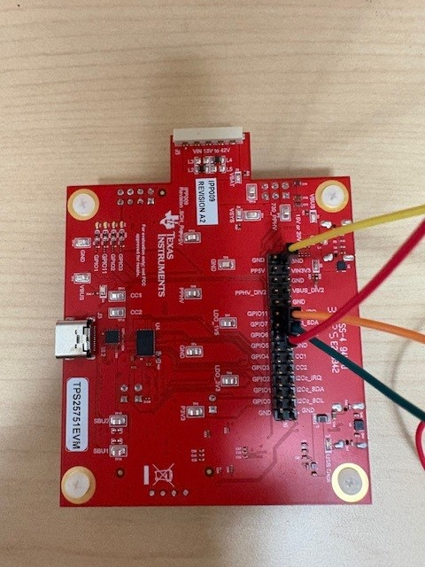
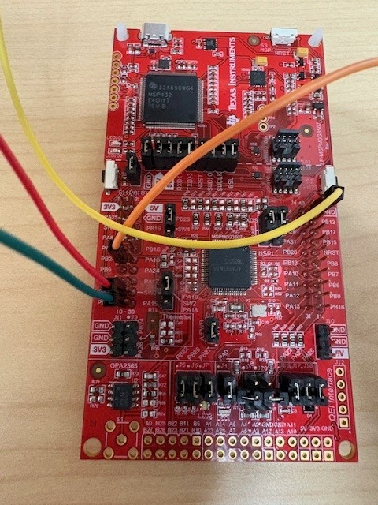
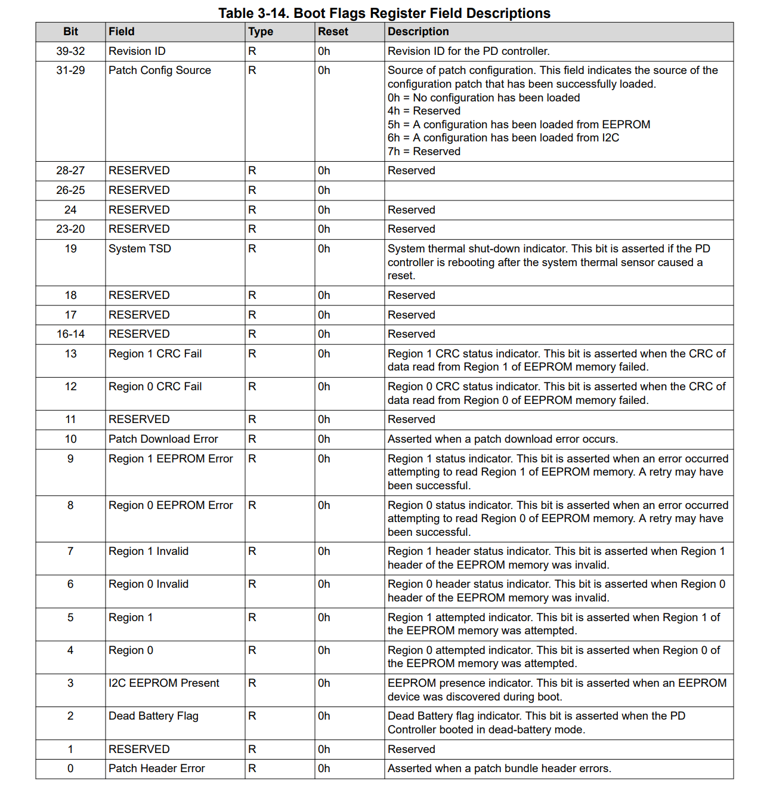
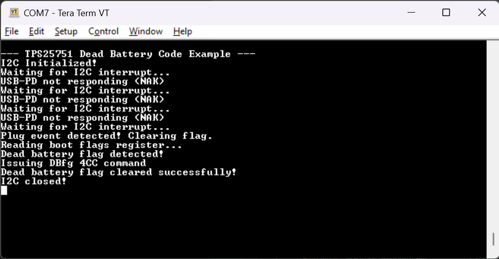

<picture>
  <source media="(prefers-color-scheme: dark)" srcset="https://www.ti.com/content/dam/ticom/images/identities/ti-brand/ti-logo-hz-1c-white.svg" width="300">
  
</picture>

# TPS25751 Dead Battery Clear Example

## Summary

This code example shows the boot-up sequence for a dead battery condition when using the [TPS25751](https://www.ti.com/product/TPS25751) and how to clear it with the relevant 4CC command. The TPS25751 is plugged in cold with no power supply  on VIN_3V3 (being instead VBUS powered). This causes the TPS25751 to go into a "dead battery" state and default to being a sink device until the dead battery flag is cleared by the MCU (in this case an [MSPM0G3507](https://www.ti.com/product/MSPM0G3507)).

## Hardware Configuration

The [TPS25751EVM](https://www.ti.com/tool/TPS25751EVM) is used in conjunction with the [LP-MSPM0G3507 LaunchPad](https://www.ti.com/tool/LP-MSPM0G3507). The I2C lines are connected via jumper wire with the MSPM0G3507 being the I2C controller and the TPS25751 being the I2C peripheral device. The jumper configuration can be seen below:

##### **[TPS25751EVM](https://www.ti.com/tool/TPS25751EVM)**



##### **[LP-MSPM0G3507](https://www.ti.com/tool/LP-MSPM0G3507)**



In this configuration, the red wire is I2C data (SDA), the green wire is I2C clock (SCL), the orange wire is I2C interrupt, and the yellow wire is ground (GND).  Also note that PB24 is used for I2C interrupts so the jumper J9 must be removed on the MSPM0 LaunchPad.

## Build Instructions

Please refer to the build instructions included in the root of the examples repository [README.md](https://github.com/TexasInstruments/usb-pd).

This code example was built using the [MSP M0 SDK](https://www.ti.com/tool/MSPM0-SDK) **v2_06_00_05** and [Code Composer Studio](https://www.ti.com/tool/CCSTUDIO) **v20.4.0.13**. This code example leverages TI-Drivers for UART logging and I2C communication as well as the FreeRTOS kernel included in the MSPM0 SDK.

Note that the device configuration file that is used to setup the TPS25751EVM has been checked into this repository in the [config.json](https://github.com/TexasInstruments/usb-pd/blob/main/examples/tps25751/mspm0g3507/tps25751_dead_battery_clear/config.json) file. You can use this JSON file with the [USB Configuration Tool](https://dev.ti.com/gallery/view/USBPD/USBCPD_Application_Customization_Tool/) as described in the [TPS25751EVM's User's Guide](https://www.ti.com/lit/pdf/SLVUCP9).

## Usage

This code example takes the register structures of the TPS25751's host interface (as described in the [TPS25751 Technical User's Manual](https://www.ti.com/lit/pdf/slvucr8)) and represents them in a standard C header file. The sink capabilities register, for example:



... is mapped pragmatically to a header file as seen below from **[tps25751.h](./tps25751.h)**:

```c
/* Boot Flags Register */
typedef struct __attribute__((packed)) sBootFlagsRegister 
{
    uint8_t  numOfBytes         : 8;
    uint8_t  patchHeaderError   : 1;
    uint8_t  reserved0          : 1;
    uint8_t  deadBatteryFlag    : 1;
    uint8_t  i2cEEPROMPresent   : 1;
    uint8_t  region0            : 1;
    uint8_t  region1            : 1;
    uint8_t  region0Invalid     : 1;
    uint8_t  region1Invalid     : 1;
    uint8_t  region0EEPROMError : 1;
    uint8_t  region1EEPROMError : 1;
    uint8_t  patchDownloadError : 1;
    uint8_t  reserved1          : 1;
    uint8_t  region0CRCFail     : 1;
    uint8_t  region1CRCFail     : 1;
    uint8_t  reserved2          : 5;
    uint8_t  systemTSD          : 1;
    uint16_t  reserved3         : 9;
    uint8_t  patchConfigSource  : 3;
    uint8_t  revisionID         : 8;
} tBootFlagsRegister;
```

Using these header files, this code example keeps a "shadow" copy of the device's configuration in RAM and shows how to keep track of the device's interrupt events register and boot flags register. In this code example, we setup the MSPM0 to listen for a falling edge interrupt on the I2C IRQ line. When in this state, plug in the USB cable to port ***J3*** on the TPS25751 making sure that the TPS25751 does not have any other power provided to it. Once plugged in, an interrupt occurs on the I2C IRQ line (that pends a semaphore) and the device attempts to read the ***Interrupt Event for I2C1 (0x14)***:

```c
    /* Waiting for the interrupt event */
    Display_printf(display, 0, 0, "Waiting for I2C interrupt...");
    xSemaphoreTake(xSemaphore, portMAX_DELAY);

    /* Setting up the read transaction to the event register */
    addrReg = TPS25751_INT_EVENT_REG;
    i2cTransaction.writeBuf   = &addrReg;
    i2cTransaction.writeCount = 1;
    i2cTransaction.readBuf    = &curEventRegister;
    i2cTransaction.readCount  = sizeof(tIntEventRegister);

    if (I2C_transfer(i2c, &i2cTransaction) == false)
    {
        Display_printf(display, 0, 0, "USB-PD not responding (NAK)");
        goto DEAD_BATTERY_TASK_START;
    }
```

At any point during the flow of this code example if the dead battery sequence doesn't behave as expected, the device will go back to listening for a falling edge interrupt on the I2C IRQ line with the goto command. 

Next, the code example will ensure that the ***Plug Insert or Removal*** bit is set in the event register. Once verified, the device will issue a command to clear the event and prevent any future interrupts:

```c
    /* Seeing if there was a plug event  */
    if(curEventRegister.plugInsertRemoval == 1)
    {
        Display_printf(display, 0, 0, "Plug event detected! Clearing flag.");

        /* If there is a plug event, clear the plug event flag */
        curWriteCommand.writeAddr = TPS25751_INT_EVENT_CLR_REG;
        memcpy(&curWriteCommand.registerData, &curEventRegister, sizeof(tIntEventRegister));
        i2cTransaction.writeCount = sizeof(tIntEventRegister) + 1;
        i2cTransaction.readCount = 0;

        if (I2C_transfer(i2c, &i2cTransaction) == false)
        {
            Display_printf(display, 0, 0, "Error clearing interrupt event registers!");
            goto DEAD_BATTERY_TASK_START;
        }
        curEventRegister.plugInsertRemoval = 0;
```

Next, as a plug event has occured and it has been established that we have a valid I2C target connection, we issue a read to the ***Boot Flags register (0x2D)*** and check to see if the ***Dead Battery Flag*** has been set:

```c
        Display_printf(display, 0, 0, "Reading boot flags register...");
        addrReg = TPS25751_BOOT_FLAGS_REG;
        i2cTransaction.writeBuf   = &addrReg;
        i2cTransaction.writeCount = 1;
        i2cTransaction.readBuf    = &curBootFlagRegister;
        i2cTransaction.readCount  = sizeof(tBootFlagsRegister);

        if (I2C_transfer(i2c, &i2cTransaction) == false)
        {
            Display_printf(display, 0, 0, "Error reading boot flag registers!");
            goto DEAD_BATTERY_TASK_START;
        }

        if(curBootFlagRegister.deadBatteryFlag == 1)
        {
            Display_printf(display, 0, 0, "Dead battery flag detected!");
        }
        else
        {
            Display_printf(display, 0, 0, "Dead battery flag not detected!");
            goto DEAD_BATTERY_TASK_START;
        }
```

If it has been set, a 4CC command (DBfg) is issued to the device to clear the dead battery flag. This 4CC command is defined with the t4CCCommand struct:

```c
const t4CCCommand deadBatteryClearCommand = 
{
    .commandRegister = TPS25751_4CC_REG,
    .numOfBytes = 4,
    .fourCCBytes = TPS25751_4CC_DBfg_CMD // ASCII DBfg
};
```

The 4CC command is sent with the standard I2C transfer command:

```c
        /* Issuing DBfg command */
        Display_printf(display, 0, 0, "Issuing DBfg 4CC command");

        i2cTransaction.writeBuf = (void*)&deadBatteryClearCommand;
        i2cTransaction.writeCount = sizeof(t4CCCommand);
        i2cTransaction.readCount  = 0;

        if (I2C_transfer(i2c, &i2cTransaction) == false)
        {
            Display_printf(display, 0, 0, "Error issuing 4CC command\n");
            goto DEAD_BATTERY_TASK_START;
        }
```

After the 4CC command is sent, a small delay is incurred and the boot flags register is read back again to ensure that the 4CC command was issued correctly:

```c
        /* Otherwise, sleep for a bit and read back the boot register to confirm dead battery
            flag was cleared */
        vTaskDelay(500 / portTICK_PERIOD_MS);
        addrReg = TPS25751_BOOT_FLAGS_REG;
        i2cTransaction.writeBuf   = &addrReg;
        i2cTransaction.writeCount = 1;
        i2cTransaction.readBuf    = &curBootFlagRegister;
        i2cTransaction.readCount  = sizeof(tBootFlagsRegister);

        if (I2C_transfer(i2c, &i2cTransaction) == false)
        {
            Display_printf(display, 0, 0, "Error reading boot flag registers!");
            goto DEAD_BATTERY_TASK_START;
        }

        if(curBootFlagRegister.deadBatteryFlag == 0)
        {
            /* Set a breakpoint here to demonstrate functionality. */
            Display_printf(display, 0, 0, "Dead battery flag cleared successfully!");
            __NOP();
        }
```

The output of the terminal can be seen below:



Note the extra NAKs in the image above represent when the device is booting up and is not ready to receive I2C traffic. Checking the plug event status will ensure the device is booted and ready to receive I2C target commands. 

## Licensing

See [LICENSE.md](https://github.com/TexasInstruments/usb-pd/blob/main/LICENSE)

---

## Developer Resources

[TI E2E™ design support forums](https://e2e.ti.com) | [Learn about software development at TI](https://www.ti.com/design-development/software-development.html) | [Training Academies](https://www.ti.com/design-development/ti-developer-zone.html#ti-developer-zone-tab-1) | [TI Developer Zone](https://dev.ti.com/)
