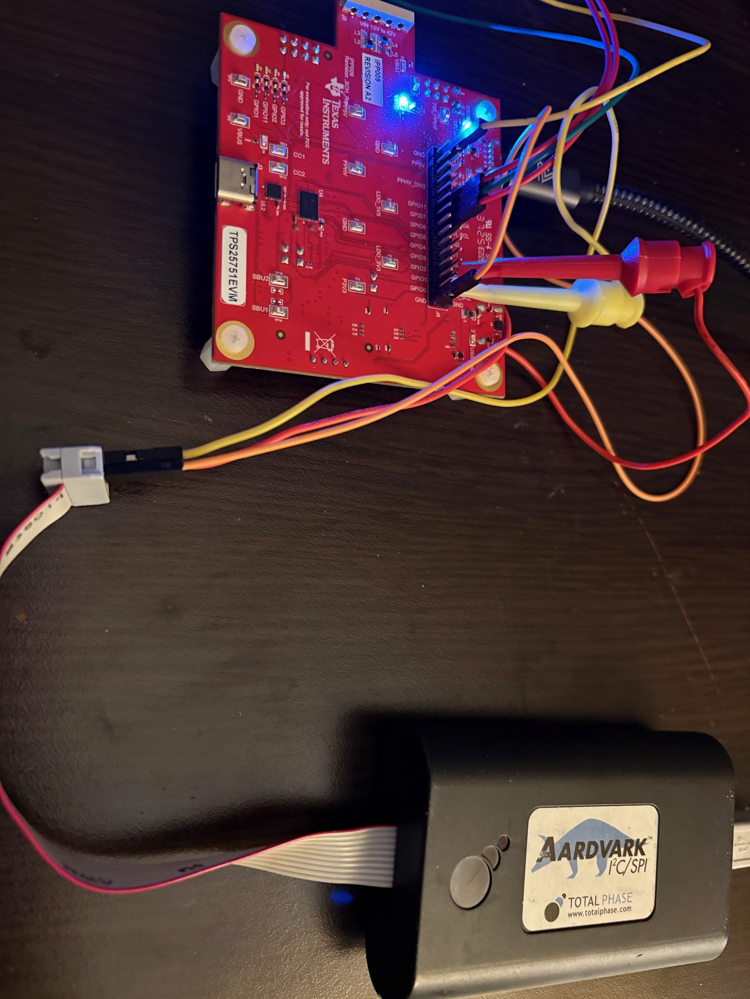
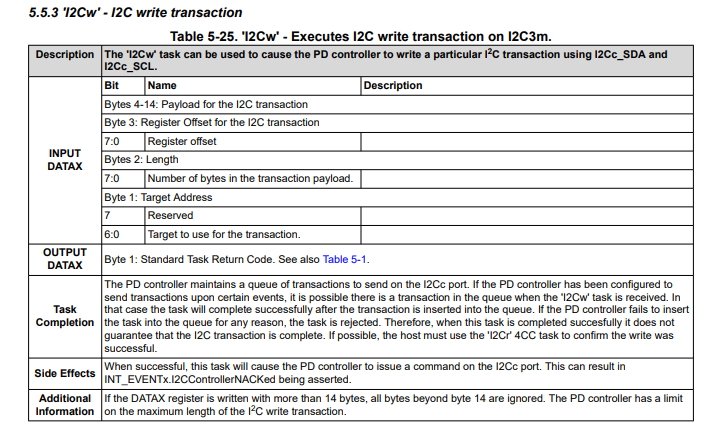
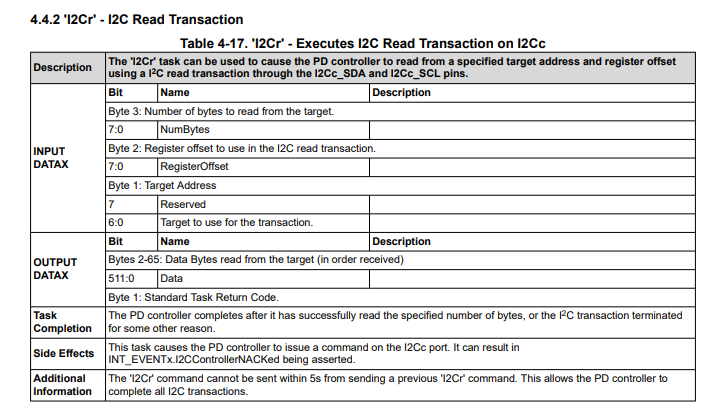
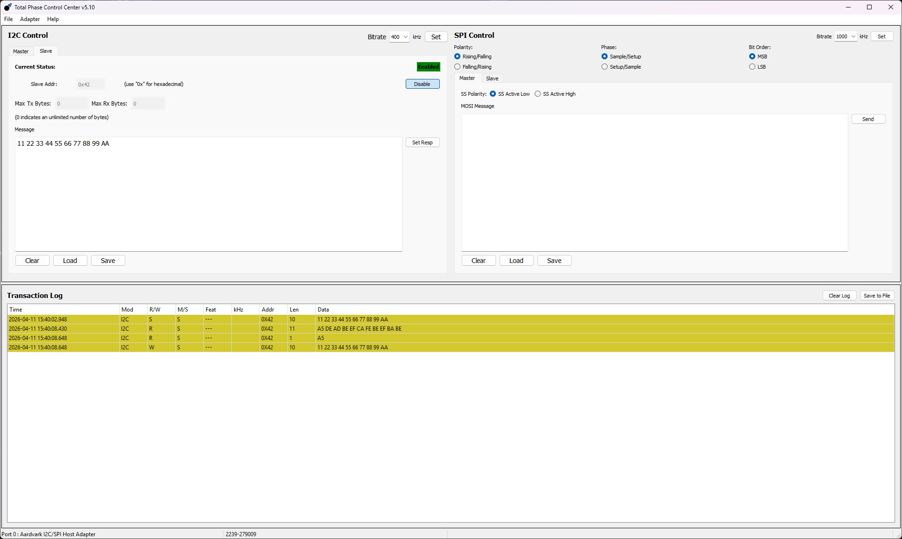
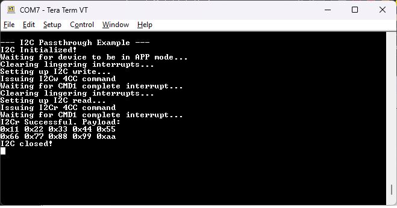

<picture>
  <source media="(prefers-color-scheme: dark)" srcset="https://www.ti.com/content/dam/ticom/images/identities/ti-brand/ti-logo-hz-1c-white.svg" width="300">
  
</picture>

# TPS25751 I2C Passthrough

## Summary

USB-PD controllers such as the TPS25751 and TPS26750 have two separate I2C lines: an I2C line used to provide the host interface to an MCU for control (I2Ct), and the I2C line used for event driven communication for battery charger communication (I2Cc). Many times there exists a use case where the MCU must read or write directly to the battery charger instead of relying solely on the event table running in the USB-PD firmware to do so. In this case, two separate 4CC commands (I2Cw and I2Cr) exist to allow the USB-PD to "pass through" I2C transactions between I2Cc and I2Ct. This code example shows a simple example on how to read and write traffic on I2Cc from an MCU connected to I2Ct.

## Limitations of the Passthrough Commands

It's important to note there are a few limitations with using the passthrough commands. Payload sizes for both the read and write transactions are limited to 10 bytes for both. Additionally, when using an the I2Cc line in conjunction with a battery charger, the duration between passthrough commands is limited to approximately 150ms due to contigency measures with the event driver on the USB-PD controller. 

## Hardware Configuration

The [TPS25751EVM](https://www.ti.com/tool/TPS25751EVM) is used with the [LP-MSPM0G3507 LaunchPad](https://www.ti.com/tool/LP-MSPM0G3507). The I2C lines are connected via jumper wire with the MSPM0G3507 being the I2C controller and the TPS25751 being the I2C peripheral device. The jumper configuration can be seen below:

##### **[TPS25751EVM](https://www.ti.com/tool/TPS25751EVM)**


##### **[LP-MSPM0G3507](https://www.ti.com/tool/LP-MSPM0G3507)**


In this configuration, the red wire is I2C data (SDA), the green wire is I2C clock (SCL), the orange wire is I2C interrupt, and the yellow wire is ground (GND).  Also note that PB24 is used for I2C interrupts so the jumper J9 must be removed on the MSPM0 LaunchPad.

To simulate an I2C peripheral device a [TotalPhase Ardvark I2C/SPI](https://www.totalphase.com/products/aardvark-i2cspi/) tool is used. This is a power tool that allows a host to "emulate" an I2C target and provide a dummy connection for the sake of debugging. The I2Cc_SDA, I2Cc_SCL, and ground lines of the TPS25751EVM are connected to the Ardvark controller as seen below:



## Build Instructions

Please refer to the build instructions included in the root of the examples repository [README.md](https://github.com/TexasInstruments/usb-pd).

This code example was built using the [MSP M0 SDK](https://www.ti.com/tool/MSPM0-SDK) **v2_06_00_05** and [Code Composer Studio](https://www.ti.com/tool/CCSTUDIO) **v20.4.0.13**. This code example leverages TI-Drivers for UART logging and I2C communication as well as the FreeRTOS kernel included in the MSPM0 SDK.

## Usage

Note that the device configuration file that is used to setup the TPS25751EVM has been checked into this repository in the [i2c_passthrough.json](https://github.com/TexasInstruments/usb-pd/blob/main/examples/tps25751/mspm0g3507/tps25751_i2c_passthrough/i2c_passthrough.json) file. You can use this JSON file with the [USB Configuration Tool](https://dev.ti.com/gallery/view/USBPD/USBCPD_Application_Customization_Tool/) as described in the [TPS25751EVM's User's Guide](https://www.ti.com/lit/pdf/SLVUCP9). This is a standard source configuration file with the CMD1 completion interrupt enabled.

This code example is separated into two different parts: writing using I2Cw and reading using I2Cr.

For the I2Cw interaction, a structure is defined in **[tps25751.h](https://github.com/TexasInstruments/usb-pd/blob/main/common/tps25751.h)** that is used to populate the CMD1 data register (0x09):

```c
/* I2Cw Parameters */
#define TPS25751_I2CW_DATA_PAYLOAD_SIZE 14
typedef union
{
    uint8_t bytes[TPS25751_I2CW_DATA_PAYLOAD_SIZE];
    struct __attribute__((packed))
    {
        uint8_t numOfBytes             : 8;
        uint8_t targetAddr             : 7;
        uint8_t reserved0              : 1;
        uint8_t numOfBytesPayload      : 8;
        uint8_t registerOffset         : 8;
        uint8_t payloadBuffer[TPS25751_I2C_PAYLOAD_SIZE];
    } bits;
} tI2CwDataReg;
```

This data structure mimics the definition found in the [TPS25751 Technical Reference Manual](https://www.ti.com/lit/ug/slvucr8a/slvucr8a.pdf?ts=1775931864508&ref_url=https%253A%252F%252Fwww.ti.com%252Fproduct%252FTPS25751) as seen below:


A couple of notes:

- The actual payload of the transaction is limited to 10 bytes

- Any passthrough commands (I2Cw or I2Cr) must wait approximately 150ms between being sent to the USB-PD to allow for processing in the firmware

First in the code example, we make sure that the device is in APP mode and that we clear any lingering interrupts. Next,  to setup the I2C write passthrough command, the corresponding parameters in the setup structure are populated and sent to the CMD data register (0x09);:

```c
   /* Note we are adding the +1 here to account for the register offset byte
        that gets sent at the start of the transaction */
    curI2CWrite.bits.numOfBytesPayload = sizeof(curI2CBuffer) + 1;
    curI2CWrite.bits.registerOffset = 0xA5;
    curI2CWrite.bits.targetAddr = 0x42;
    memcpy(curI2CWrite.bits.payloadBuffer, curI2CBuffer, sizeof(curI2CBuffer));

    /* Setting up the actual I2C transaction to populate the data register*/
    curWriteCommand.writeAddr = TPS25751_CMD1_DATA_REG;
    memcpy(&curWriteCommand.registerData, &curI2CWrite.bytes, sizeof(tI2CwDataReg));
    i2cTransaction.writeBuf   = &curWriteCommand;
    i2cTransaction.readCount = 0;
    i2cTransaction.writeCount = sizeof(tI2CwDataReg) + 1;

    if (I2C_transfer(i2c, &i2cTransaction) == false)
    {
        Display_printf(display, 0, 0, "USB-PD not responding (NAK)");
        goto TPS25751ErrorClosure;
    }
```

In the code above the ***targetAddr*** parameter represents the target address of the desired peripheral device to communicate with on the I2Cc line. The ***registerOffset*** paramter corresponds to the "register" on the I2Cc peripheral that we intend to write. Functionally, when specifying the ***registerOffset*** parameter on an I2Cw command, it means that the first byte that is written on the payload will be the byte provided to the ***registerOffset*** parameter.

After the command parameter data is populated, the I2Cw 4CC command is issued and the corresponding I2C write transaction occurs on the I2Cc line (see the Ardvark log at the end of this page).

Next, an I2C read transaction is shown using the I2Cr 4CC command. Like the I2Cw command, a data structure is defined in **[tps25751.h](https://github.com/TexasInstruments/usb-pd/blob/main/common/tps25751.h)** that represents the parameters required as described in the technical reference manual:

```c
#define TPS25751_I2CR_DATA_PAYLOAD_SIZE 15
typedef union
{
    uint8_t bytes[TPS25751_I2CR_DATA_PAYLOAD_SIZE];
    struct __attribute__((packed))
    {
        uint8_t numOfBytes          : 8;
        uint8_t targetAddr          : 7;
        uint8_t reserved0           : 1;
        uint8_t registerOffset      : 8;
        uint8_t numOfBytesPayload   : 8;
    } bits;
} tI2CrDataReg;
```



A fewof notes:

- The ***numOfBytes*** parameter is for the actual write transaction itself and not part of the I2Cr 4CC command.

- The actual payload of the transaction is limited to 10 bytes, despite more bytes being allocated above

- Disregard the five second requirement from the above screenshot and instead use 150ms as the guideline for the limitation between commands.

Additionally, as the read transaction requires a response, a structure to store the response is also defined:

```c
#define TPS25751_I2CR_RESP_SIZE 12
#define TPS25751_I2C_PAYLOAD_SIZE 10
typedef union
{
    uint8_t bytes[TPS25751_I2CR_RESP_SIZE];
    struct __attribute__((packed))
    {
        uint8_t numOfBytes     : 8;
        uint8_t status         : 8;
        uint8_t payLoadResp[TPS25751_I2C_PAYLOAD_SIZE];
    } bits;
} tI2CrRespReg;
```

The read parameters are filled out and written to the CMD1 data register as seen below:

```c
    /* Setting up the I2C Read */
    Display_printf(display, 0, 0, "Setting up I2C read...");
    curI2CRead.bits.numOfBytesPayload = sizeof(curI2CReadBuffer);
    curI2CRead.bits.registerOffset = 0xA5;
    curI2CRead.bits.targetAddr = 0x42;

    /* Setting up the actual I2C transaction to populate the data register */
    curWriteCommand.writeAddr = TPS25751_CMD1_DATA_REG;
    memcpy(&curWriteCommand.registerData, &curI2CRead.bytes, sizeof(tI2CrDataReg));
    i2cTransaction.writeBuf   = &curWriteCommand;
    i2cTransaction.readCount = 0;
    i2cTransaction.writeCount = sizeof(tI2CrDataReg) + 1;

    if (I2C_transfer(i2c, &i2cTransaction) == false)
    {
        Display_printf(display, 0, 0, "USB-PD not responding (NAK)");
        goto TPS25751ErrorClosure;
    }
```

Specifying the ***registerOffset*** parameter in the case of I2Cr means that the USB-PD controller will first write one byte as specified by the ***registerOffset*** parameter, followed by a repeated I2C start, followed by the specified read command. 

After setting up the parameters,  the actual 4CC command is issued:

```c
   /* Now that data register is populated, issuing 4CC command to read */
    Display_printf(display, 0, 0, "Issuing I2Cr 4CC command");
    i2cTransaction.writeBuf = (void*)&i2cReadCommand;
    i2cTransaction.writeCount = sizeof(t4CCCommand);
    i2cTransaction.readCount  = 0;

    if (I2C_transfer(i2c, &i2cTransaction) == false)
    {
        Display_printf(display, 0, 0, "Error issuing 4CC command\n");
        goto TPS25751ErrorClosure;
    }
```

We go into low-power mode on the MSPM0 and wait for the interrupt line of I2Ct to toggle and tell us that CMD1 completed successfuly. After verifying success, we read the response data from the CMD1 data register and print out the resulting payload on the terminal:

```c
    /* Reading the response */
    addrReg = TPS25751_CMD1_DATA_REG;
    i2cTransaction.writeBuf   = &addrReg;
    i2cTransaction.writeCount = 1;
    i2cTransaction.readBuf    = i2cReadRespReg.bytes;
    i2cTransaction.readCount  = sizeof(tI2CrRespReg);

    if (I2C_transfer(i2c, &i2cTransaction) == false)
    {
        Display_printf(display, 0, 0, "USB-PD not responding (NAK)");
        goto TPS25751ErrorClosure;
    }
```

The completed I2C log from the Ardvark software can be seen below:


The output of the terminal can be seen below:



## Licensing

See [LICENSE.md](https://github.com/TexasInstruments/usb-pd/blob/main/LICENSE)

---

## Developer Resources

[TI E2E™ design support forums](https://e2e.ti.com) | [Learn about software development at TI](https://www.ti.com/design-development/software-development.html) | [Training Academies](https://www.ti.com/design-development/ti-developer-zone.html#ti-developer-zone-tab-1) | [TI Developer Zone](https://dev.ti.com/)
