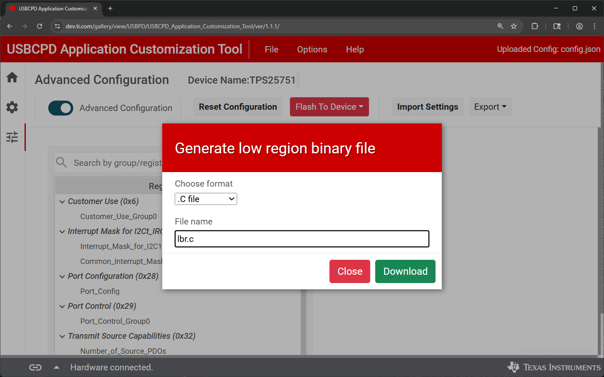
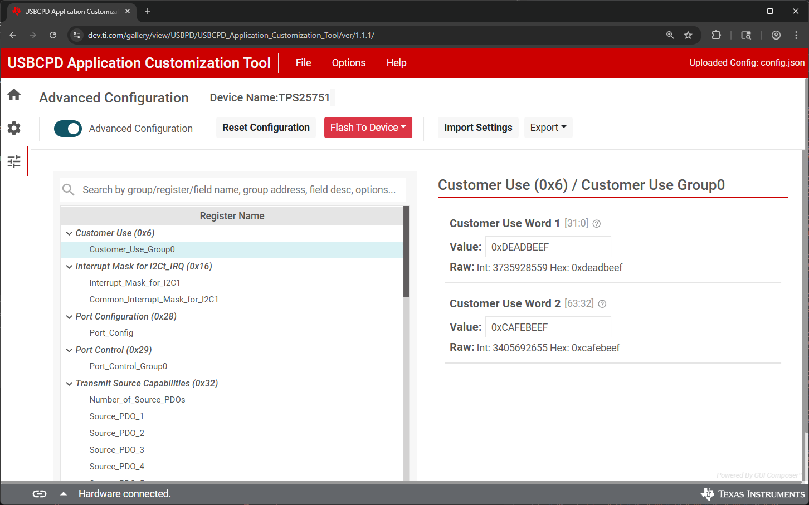
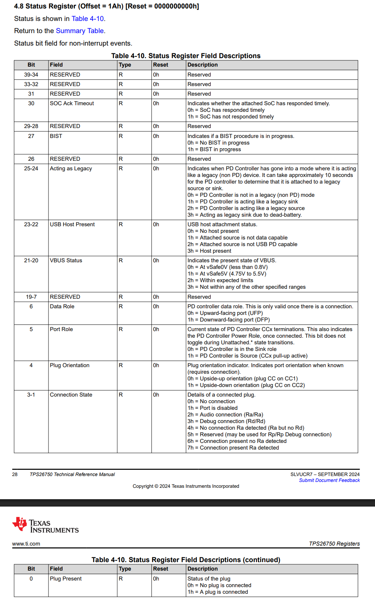
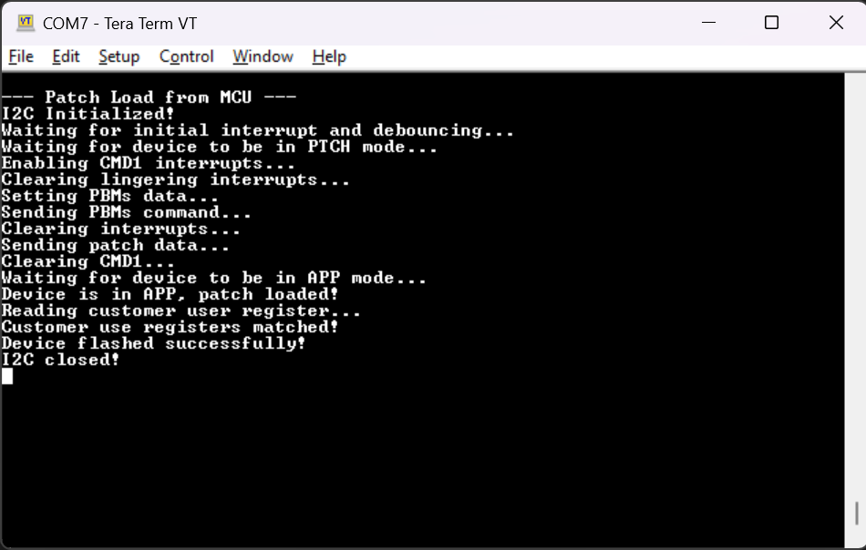

<picture>
  <source media="(prefers-color-scheme: dark)" srcset="https://www.ti.com/content/dam/ticom/images/identities/ti-brand/ti-logo-hz-1c-white.svg" width="300">
  
</picture>

# TPS25751 Load Configuration from MCU Flash

## Summary

This code example shows how to load a patch configuration to the [TPS25751](https://www.ti.com/product/TPS25751) directly from the MCU flash without the need for any external EEPROM. This flow is roughly based off the flow from the [Using an Embedded Controller (EC) to Load a Patch Bundle Directly to the TPS25751 or TPS26750 ](https://www.ti.com/lit/pdf/slvafv8) application note, however uses the [MSPM0G3507](https://www.ti.com/product/MSPM0G3507) microcontroller in combination with FreeRTOS/TI-Drivers to manage the communication. 

## Hardware Configuration

The [TPS25751EVM](https://www.ti.com/tool/TPS25751EVM) is used with the [LP-MSPM0G3507 LaunchPad](https://www.ti.com/tool/LP-MSPM0G3507). The I2C lines are connected via jumper wire with the MSPM0G3507 being the I2C controller and the TPS25751 being the I2C peripheral device. The jumper configuration can be seen below:

##### **[TPS25751EVM](https://www.ti.com/tool/TPS25751EVM)**


##### **[LP-MSPM0G3507](https://www.ti.com/tool/LP-MSPM0G3507)**


In this configuration, the red wire is I2C data (SDA), the green wire is I2C clock (SCL), the orange wire is I2C interrupt, and the yellow wire is ground (GND).  Also note that PB24 is used for I2C interrupts so the jumper J9 must be removed on the MSPM0 LaunchPad.

Also note that in order to disable the EEPROM, the jumper **J10** on the TPS25751EVM must be removed. 

## Build Instructions

Please refer to the build instructions included in the root of the examples repository [README.md](https://github.com/TexasInstruments/usb-pd).

This code example was built using the [MSP M0 SDK](https://www.ti.com/tool/MSPM0-SDK) **v2_06_00_05** and [Code Composer Studio](https://www.ti.com/tool/CCSTUDIO) **v20.4.0.13**. This code example leverages TI-Drivers for UART logging and I2C communication as well as the FreeRTOS kernel included in the MSPM0 SDK.

## Usage

Note that the device configuration file that is used to setup the TPS25751EVM has been checked into this repository in the [config.json](https://github.com/TexasInstruments/usb-pd/blob/main/examples/tps25751/mspm0g3507/tps25751_patch_load_from_mcu/config.json) file. You can use this JSON file with the [USB Configuration Tool](https://dev.ti.com/gallery/view/USBPD/USBCPD_Application_Customization_Tool/) as described in the [TPS25751EVM's User's Guide](https://www.ti.com/lit/pdf/SLVUCP9).

The patch image from this code example (stored in **[lbr.c](./lbr.c)**) was generated from the same USB configuration tool. To generate a C header file to load to the TPS25751, go to the **Export->Generate low region binary** option of the configuration tool:



In order to verify that the patch was loaded to the TPS25751 correctly, the customer use registers are set to special values via the configuration tool:


After the patch is loaded, this register is read to ensure that the correct values have been persisted.

This code example takes the register structures of the TPS25751's host interface (as described in the [TPS25751 Technical User's Manual](https://www.ti.com/lit/pdf/slvucr8)) and represents them in a standard C header file. The status register, for example:



... is mapped pragmatically to a header file as seen below from **[tps25751.h](./tps25751.h)**:

```c
/* Status Register */
typedef union 
{
    uint8_t bytes[6];
    struct __attribute__((packed))
    {
        uint8_t  numOfBytes         : 8;
        uint8_t  plugPresent        : 1;
        uint8_t  connectionState    : 3;
        uint8_t  plugOrientation    : 1;
        uint8_t  portRole           : 1;
        uint8_t  dataRole           : 1;
        uint16_t reserved0          : 13;
        uint8_t  vbusStatus         : 2;
        uint8_t  usbHostPresent     : 2;
        uint8_t  actingAsLegacy     : 2;
        uint8_t  reserved1          : 1;
        uint8_t  bist               : 1;
        uint8_t  reserved2          : 2;
        uint8_t  socAckTimeout      : 1;
        uint16_t  reserved3          : 9;
    } bits;
} tStatusRegister;
```

Using these header files, this code example keeps a "shadow" copy of the device's configuration in RAM and shows how to keep track of the device's interrupt events registers. In this code example, we setup the MSPM0 to listen for a falling edge interrupt on the I2C IRQ line. This is done initially to detect the first boot-up of the device (and to add a debounce to filter out any glitches):

```c
    /* Waiting for an interrupt and debouncing */
    Display_printf(display, 0, 0, "Waiting for initial interrupt and debouncing...");
    do
    {
        xSemaphoreTake(xSemaphore, portMAX_DELAY);
        vTaskDelay(50 / portTICK_PERIOD_MS);
    } while (GPIO_read(CONFIG_GPIO_PD_IRQ));
```

The interrupt handler for the interrupt GPIO can be seen below:

```c
void interruptEventCallback(uint_least8_t index)
{
    xSemaphoreGiveFromISR(xSemaphore, NULL);
}
```

After booting up, the device periodically reads the MODE register and waits for it to return that the device is in PTCH mode:

```c
    /* Waiting for the device to be in PTCH mode  */
    modeReg.mode = 0;
    addrReg = TPS25751_MODE_REG;
    Display_printf(display, 0, 0, "Waiting for device to be in PTCH mode...");
    while (modeReg.mode != TPS25751_MODE_PTCH)
    {
        vTaskDelay(10 / portTICK_PERIOD_MS);

        i2cTransaction.writeBuf   = &addrReg;
        i2cTransaction.writeCount = 1;
        i2cTransaction.readBuf    = &modeReg;
        i2cTransaction.readCount  = sizeof(tModeRegister);

        I2C_transfer(i2c, &i2cTransaction);
    }
```

Throughout the code example, the **ready for patch** and **CMD1 complete** interrupts are used for synchronization. As such, the interrupt masks are enabled so that the IRQ line toggles accordingly:
```c
    /* Setting interrupt mask to enable CMD1 complete and PATCH loaded */
    Display_printf(display, 0, 0, "Enabling CMD1 interrupts...");
    curWriteCommand.writeAddr = TPS25751_INT_EVENT_MASK_REG;
    memcpy(&curWriteCommand.registerData, &curEventRegister.bytes, sizeof(tIntEventRegister));
    i2cTransaction.writeCount = sizeof(tIntEventRegister) + 1;
    i2cTransaction.writeBuf = &curWriteCommand;
    i2cTransaction.readCount = 0;

    if (I2C_transfer(i2c, &i2cTransaction) == false)
    {
        Display_printf(display, 0, 0, "USB-PD not responding (NAK)");
        goto TPS25751ErrorClosure;
    }
```

The first part of the patch load process is to issue the PBMs 4CC command. Before doing this, however, the relevant data needs to be set to the CMD Data register. This data has been prepoulated in the defined structure at the top of the file:
```c
static tPBMDataReg curPBMDataReg = 
{
    .bits.numOfBytes = TPS25751_PBM_DATA_PAYLOAD_SIZE,
    .bits.i2cTargetAddr = TPS25751_BURST_REG,
    .bits.timeoutValue = TPS25751_PBMS_TIMEOUT
};
```

Note that the image size is populated during runtime when the PBMs data is persisted to avoid link-time restrictions:
```c
    /* Send PBMs Data */
    Display_printf(display, 0, 0, "Setting PBMs data...");
    curPBMDataReg.bits.lowerRegionSize = gSizeLowRegionArray;
    memcpy(&curWriteCommand.registerData, &curPBMDataReg.bytes, sizeof(tPBMDataReg));
    curWriteCommand.writeAddr = TPS25751_CMD1_DATA_REG;
    i2cTransaction.writeBuf = &curWriteCommand;
    i2cTransaction.writeCount = sizeof(tPBMDataReg) + 1;
    i2cTransaction.readCount = 0;

    if (I2C_transfer(i2c, &i2cTransaction) == false)
    {
        Display_printf(display, 0, 0, "USB-PD not responding (NAK)");
        goto TPS25751ErrorClosure;
    }
```

After the PBMs data has been persisted to the device, we are ready to issue the PBMs 4CC command and start to pipe in the patch data. Below, the PBMs command is issued and we wait for an interrupt to signal that we can start to pipe data to the device:
```c
    /* Sending PMBs Command */
    Display_printf(display, 0, 0, "Sending PBMs command...");
    i2cTransaction.writeBuf = (void*)&pbms4CCCommand;
    i2cTransaction.writeCount = sizeof(t4CCCommand);
    i2cTransaction.readCount  = 0;

    if (I2C_transfer(i2c, &i2cTransaction) == false)
    {
        Display_printf(display, 0, 0, "Error issuing 4CC command\n");
        goto TPS25751ErrorClosure;
    }

    /* Waiting for CMD1 interrupt */
    xSemaphoreTake(xSemaphore, portMAX_DELAY);
```

After verifying that the command went through successfully, we transfer the patch data in one big I2C transaction:
```c
    Display_printf(display, 0, 0, "Sending patch data...");
    i2cTransaction.targetAddress = TPS25751_BURST_REG;
    i2cTransaction.writeBuf = (void*)(tps25751x_lowRegion_i2c_array);
    i2cTransaction.writeCount = gSizeLowRegionArray;
    i2cTransaction.readCount = 0;

    if (I2C_transfer(i2c, &i2cTransaction) == false)
    {
        Display_printf(display, 0, 0, "USB-PD not responding (NAK)");
        goto TPS25751ErrorClosure;
    }
```

After a short delay and verification that the command was executed, we pend on the IRQ semaphore to make sure that the firmware patch was loaded correctly. From there, we poll the MODE register to ensure that we have entered APP mode successfully:
```c
   /* Reading the MODE register to verify we are now in APP  mode */
    Display_printf(display, 0, 0, "Waiting for device to be in APP mode...");
    addrReg = TPS25751_MODE_REG;
    modeReg.mode = 0;  
    while (modeReg.mode != TPS25751_MODE_APP)
    {
        vTaskDelay(10 / portTICK_PERIOD_MS);

        i2cTransaction.writeBuf   = &addrReg;
        i2cTransaction.writeCount = 1;
        i2cTransaction.readBuf    = &modeReg;
        i2cTransaction.readCount  = sizeof(tModeRegister);

         if (I2C_transfer(i2c, &i2cTransaction) == false)
        {
            Display_printf(display, 0, 0, "USB-PD not responding (NAK)");
            goto TPS25751ErrorClosure;
        }
    }
```

The final step of the program is to read the customer user register to ensure that the values we set in the initial step through the configuration tool persisted correctly to the patch:
```c
    /* Reading customer use register 1 */
    Display_printf(display, 0, 0, "Reading customer user register...");
    addrReg = TPS25751_CUST_USE_REG;
    i2cTransaction.writeBuf   = &addrReg;
    i2cTransaction.writeCount = 1;
    i2cTransaction.readBuf    = &custReg;
    i2cTransaction.readCount  = sizeof(tCustomerUseRegister);

    if (I2C_transfer(i2c, &i2cTransaction) == false)
    {
        Display_printf(display, 0, 0, "USB-PD not responding (NAK)");
        goto TPS25751ErrorClosure;
    }
```

The output of the terminal can be seen below:


The full [Saleae](https://saleae.com/) logic trace can be found below:
[logic.sal](https://github.com/TexasInstruments/usb-pd/blob/main/examples/tps25751/mspm0g3507/tps25751_patch_load_from_mcu/logic.sal)

## Licensing

See [LICENSE.md](https://github.com/TexasInstruments/usb-pd/blob/main/LICENSE)

---

## Developer Resources

[TI E2E™ design support forums](https://e2e.ti.com) | [Learn about software development at TI](https://www.ti.com/design-development/software-development.html) | [Training Academies](https://www.ti.com/design-development/ti-developer-zone.html#ti-developer-zone-tab-1) | [TI Developer Zone](https://dev.ti.com/)
