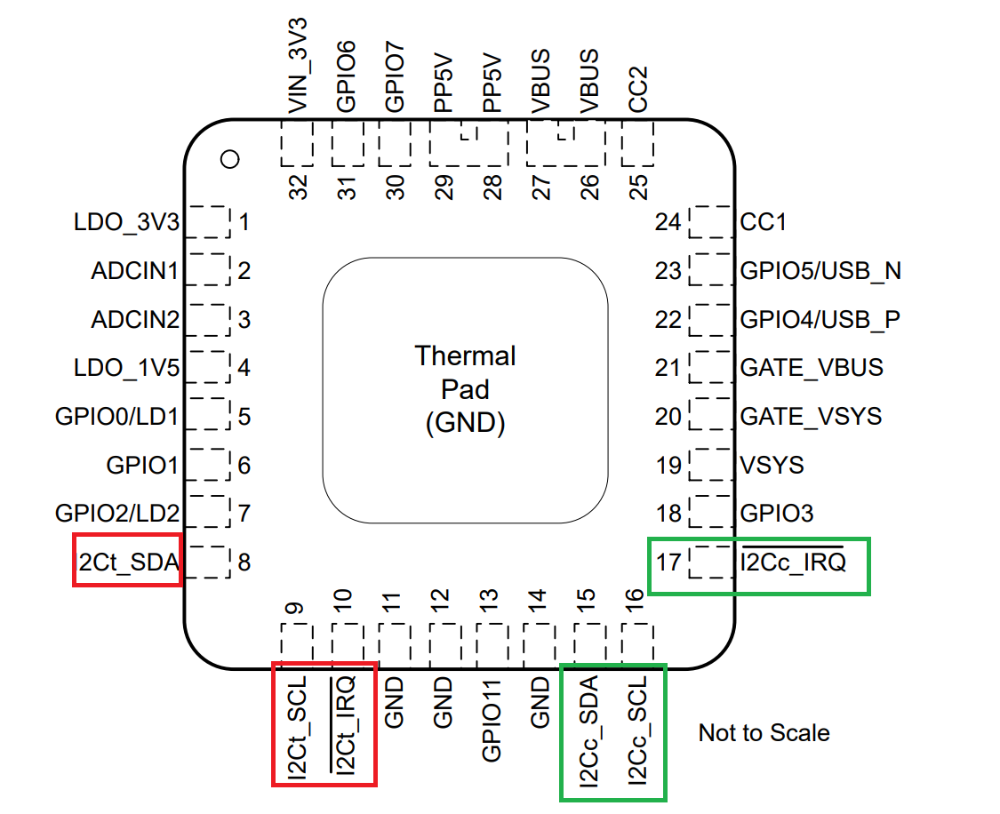
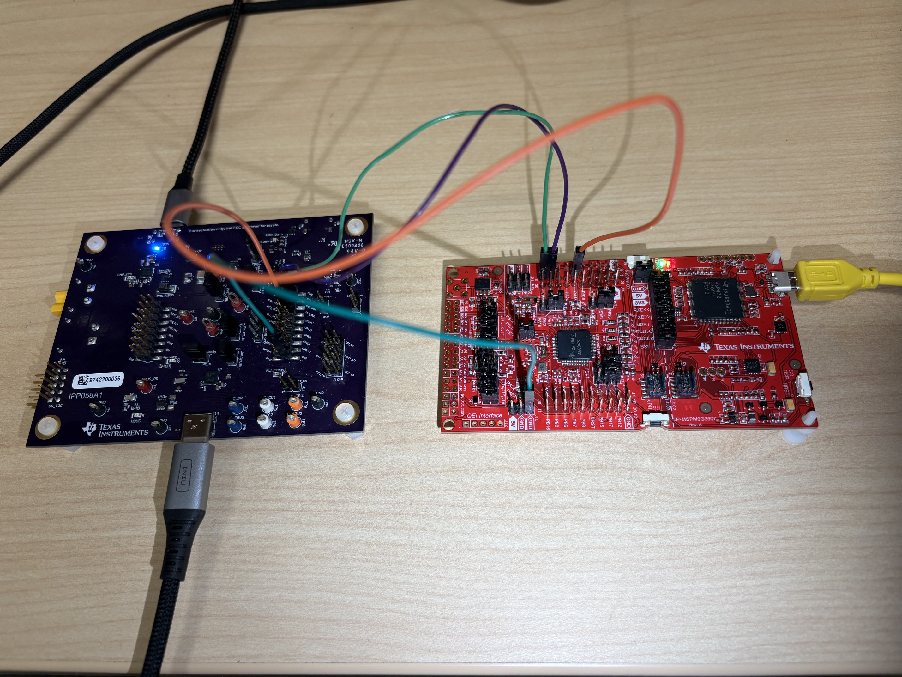
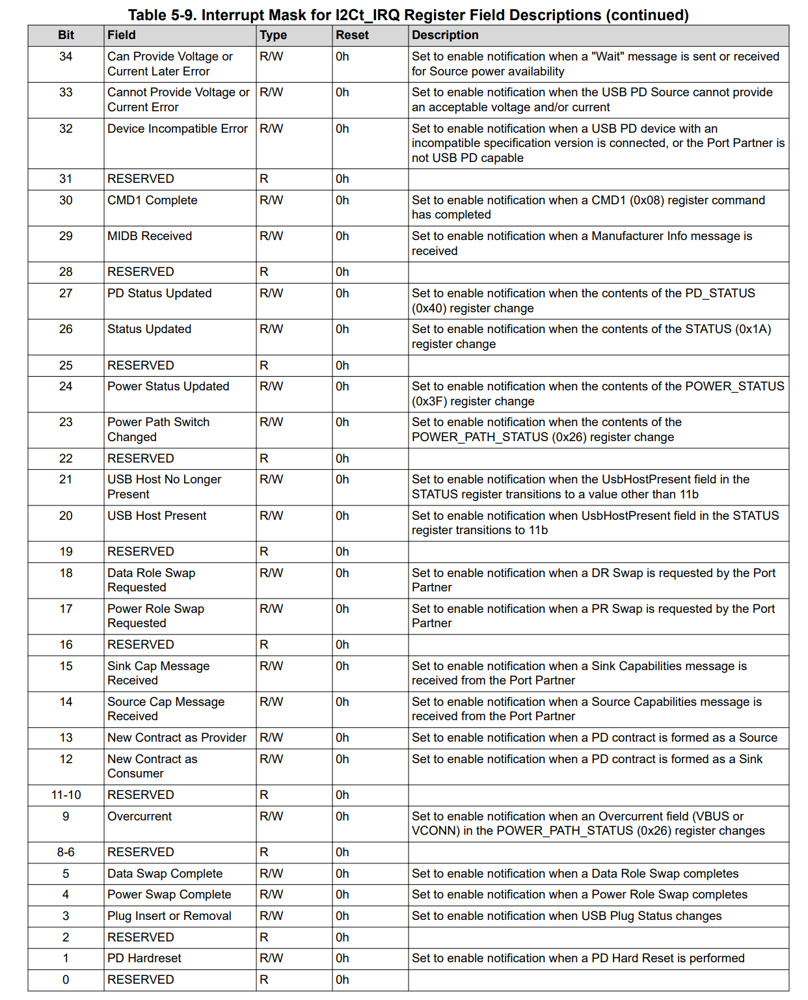
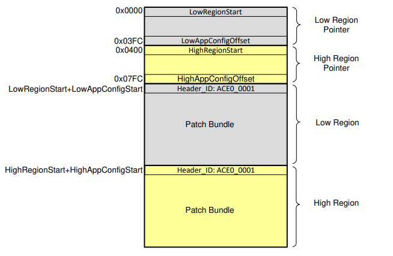
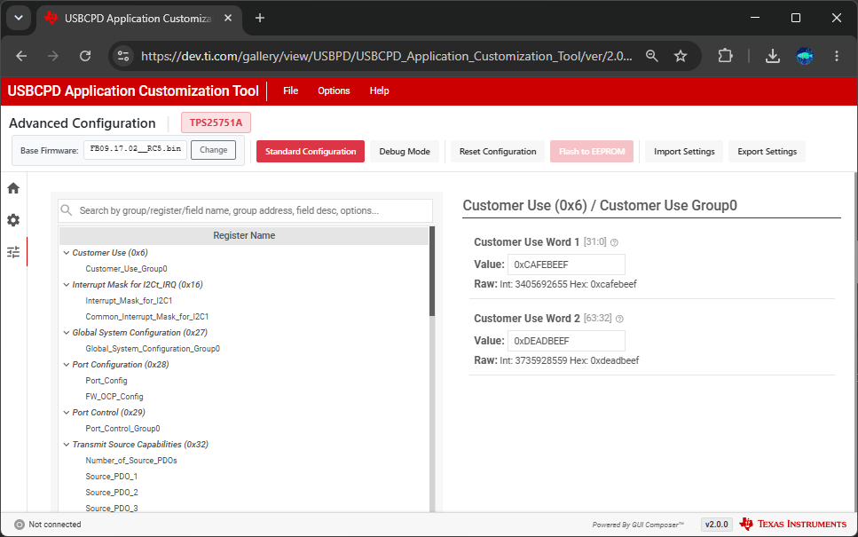
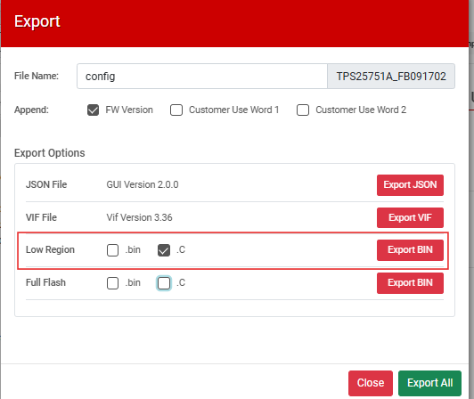
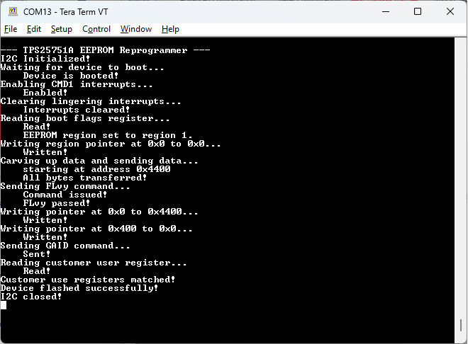

<picture>
  <source media="(prefers-color-scheme: dark)" srcset="https://www.ti.com/content/dam/ticom/images/identities/ti-brand/ti-logo-hz-1c-white.svg" width="300">
  
</picture>

# TPS25751A EEPROM Reprogrammer

## Summary

This code example shows how to use a host microcontroller to reprogram a EEPROM attached to a TPS25751A device. The program flow and EEPROM update process draws heavily from the [TPS25751 and TPS26750 EEPROM Update Over I2C](https://www.ti.com/lit/pdf/SLVAFL1) application note. While some of the function names and program semantics differ in this code example versus the application note, the flow and I2C traffic is identical. 


This code example was tested and developed using the TPS25751A, however the same programming flow will also work for the non-A variant of the device as well as the TPS26750(A) USB-PD devices. For each of these devices there are two I2C buses: I2Cc and I2Ct as noted below:



The I2Cc bus is leveraged by the TPS25751A as the host and is used to communicate with an attached battery charger/DCDC device as well as load initial patch/configuration code from an attached EEPROM at first boot. The I2Ct lines are the main interface that are used for an attached microcontroller/processor to communicate with the TPS25751A with the TPS25751A device acting as the I2C peripheral device. The software in this code example demonstrates how to use a host microcontroller connected to the I2Ct bus to reprogram the EEPROM connected to I2Cc (using the TPS25751A as a passthrough). 

## Hardware Configuration

The [TPS25751AEVM](https://www.ti.com/tool/TPS25751EVM) is used with the [LP-MSPM0G3507 LaunchPad](https://www.ti.com/tool/LP-MSPM0G3507). The I2C lines are connected via jumper wire with the MSPM0G3507 being the I2C controller and the TPS25751A being the I2C peripheral device. The connection configuration can be seen below:

##### **[TPS25751AEVM](https://www.ti.com/tool/TPS25751AEVM)**



In this configuration, the following connections are made:

- GND of the TPS25751A is connected to any available GND pin of the LP-MSPM0G3507

- I2Ct_SCL of the TPS25751A is connected to PB2 of the LP-MSPM0G3507

- I2Ct_SDA of the TPS25751A is connected to PB3 of the LP-MSPM0G3507

- I2Ct_IRQ of the TPS25751A is connected to PB24 of the LP-MSPM0G3507

## Build Instructions

Please refer to the build instructions included in the root of the examples repository [README.md](https://github.com/TexasInstruments/usb-pd).

This code example was built using the [MSP M0 SDK](https://www.ti.com/tool/MSPM0-SDK) **v2_06_00_05** and [Code Composer Studio](https://www.ti.com/tool/CCSTUDIO) **v20.4.0.13**. This code example leverages TI-Drivers for UART logging and I2C communication as well as the FreeRTOS kernel included in the MSPM0 SDK.

## Usage

Note that the device configuration file that is used to setup the TPS25751AEVM has been checked into this repository in the [config.json](https://github.com/TexasInstruments/usb-pd/blob/main/examples/tps25751a/mspm0g3507/tps25751a_eeprom_reprogram/config.json) file. You can use this JSON file with the [USB Configuration Tool](https://dev.ti.com/gallery/view/USBPD/USBCPD_Application_Customization_Tool/) as described in the [TPS25751AEVM's User's Guide](https://www.ti.com/lit/pdf/SLVUDL4).

The configuration file above is a default configuration file with the default interrupts enabled. The code example will explicitly enable the **CMD1 Complete** interrupt pragmatically through the following code:

```c
    /* Setting interrupt mask to enable CMD1  */
    Display_printf(display, 0, 0, "Enabling CMD1 interrupts...");
    curEventRegister.bits.cmd1Complete = 1;
    curWriteCommand.writeAddr = TPS25751_INT_EVENT_MASK_REG;
    memcpy(&curWriteCommand.registerData, &curEventRegister.bytes, sizeof(tIntEventRegister));
    i2cTransaction.writeCount = sizeof(tIntEventRegister) + 1;
    i2cTransaction.writeBuf = &curWriteCommand;
    i2cTransaction.readCount = 0;

    if (I2C_transfer(i2cHandle, &i2cTransaction) == false)
    {
        Display_printf(display, 0, 0, "USB-PD not responding (NAK)");
        goto TPS25751ErrorClosure;
    }

    Display_printf(display, 0, 0, "    Enabled!");

```

Refer to the [TPS25751A Technical Reference Manual](https://www.ti.com/lit/pdf/SPMU379) for detailed information about available interrupts and how to enable them.

This code example takes the register structures of the TPS25751A's host interface (as described in the [TPS25751A Technical Reference Manual](https://www.ti.com/lit/pdf/SPMU379)) and represents them in a standard C header file. The interrupt event register, for example:




... is mapped pragmatically to a header file as seen below from **[tps25751.h](https://github.com/TexasInstruments/usb-pd/blob/main/common/tps25751.h)**:

```c
/* Interrupt Event Register */
typedef union
{
    uint8_t bytes[12];
    struct __attribute__((packed))  
    {
        uint8_t  numOfBytes         : 8;
        uint8_t  reserved0          : 1;
        uint8_t  pdHardReset        : 1;
        uint8_t  reserved1          : 1;
        uint8_t  plugInsertRemoval  : 1;
        uint8_t  powerSwapComplete  : 1;
        uint8_t  dataSwapComplete   : 1;
        uint8_t  reserved2          : 1;
        uint8_t  reserved3          : 1;
        uint8_t  reserved4          : 1;
        uint8_t  overcurrent        : 1;
        uint8_t  reserved5          : 1;
        uint8_t  reserved6          : 1;
        uint8_t  newContractCons    : 1;
        uint8_t  newContractProv    : 1;
        uint8_t  sourceCapRec       : 1;
        uint8_t  sinkCapRec         : 1;
        uint8_t  reserved7          : 1;
        uint8_t  powerSwapReq       : 1;
        uint8_t  dataswapReq        : 1;
        uint8_t  reserved8          : 1;
        uint8_t  usbHostPresent     : 1;
        uint8_t  usbHostNotPresent  : 1;
        uint8_t  reserved9          : 1;
        uint8_t  pwrPathSwChanged   : 1;
        uint8_t  powerStatUpdate    : 1;
        uint8_t  reserved10         : 1;
        uint8_t  statusUpdate       : 1;
        uint8_t  pdStatusUpdate     : 1;
        uint8_t  reserved11         : 2;
        uint8_t  cmd1Complete       : 1;
        uint8_t  reserved12         : 1;
        uint8_t  devIncompError     : 1;
        uint8_t  cannotProvVolCur   : 1;
        uint8_t  canProvVolCurLtr   : 1;
        uint8_t  powerEvent         : 1;
        uint8_t  missingGetCaps     : 1;
        uint8_t  reserved13         : 1;
        uint8_t  protocolError      : 1;
        uint8_t  msgDataError       : 1;
        uint8_t  reserved14         : 2;
        uint8_t  sinkTransComplete  : 1;
        uint8_t  plugEarlyNotf      : 1;
        uint8_t  reserved15         : 2;
        uint8_t  unableToSource     : 1;
        uint16_t  reserved16        : 9;
        uint8_t  extDCDCSinkSafe    : 1;
        uint8_t  extDCDCSourceSafe  : 1;
        uint8_t  reserved17         : 2;
        uint8_t  liquidDetect       : 1;
        uint8_t  reserved18         : 4;
        uint8_t  txMemBuffEmpty     : 1;
        uint8_t  mbrdBuffReady      : 1;
        uint16_t  reserved19        : 13;
        uint8_t  patchLoaded        : 1;
        uint8_t  rdyForPatch        : 1;
        uint8_t  i2cConNacked       : 1;
        uint8_t  reserved20         : 5;
    } bits;
} tIntEventRegister;
```

Using these header files, this code example keeps a "shadow" copy of the device's configuration in RAM and shows how to keep track of the device's interrupt events registers. Note that although the header file referenced above is named for the [TPS25751](https://www.ti.com/product/TPS25751), the register set and bit definitions will be identical for the [TPS25751A](https://www.ti.com/product/TPS25751A) used in this example.

In this code example, we setup the MSPM0 to listen for a falling edge interrupt on the I2Ct_IRQ line. This is done periodically throughout the code to prevent polling the I2C line and waiting for certain events to take place:

```c
PendOnCMD1Int:
   /* Pending on CMD1 Completion interrupt*/
    xSemaphoreTake(xSemaphore, portMAX_DELAY);

```

The interrupt handler for the interrupt GPIO can be seen below:

```c
void interruptEventCallback(uint_least8_t index)
{
    xSemaphoreGiveFromISR(xSemaphore, NULL);
}
```

A convenience function (**pendOnCMD1Interrupt**) is added in the code example that pends the semaphore, reads/clears the currently pended interrupt, and only returns when a **CMD1 Complete** interrupt is pended. 

After booting up, the device periodically reads the MODE register and waits for it to return that the device is in APP mode:

```c
    /* Waiting for the device to be booted  */
    modeReg.mode = 0;
    addrReg = TPS25751_MODE_REG;
    Display_printf(display, 0, 0, "Waiting for device to boot...");
    while (modeReg.mode != TPS25751_MODE_APP)
    {
        vTaskDelay(10 / portTICK_PERIOD_MS);

        i2cTransaction.writeBuf   = &addrReg;
        i2cTransaction.writeCount = 1;
        i2cTransaction.readBuf    = &modeReg;
        i2cTransaction.readCount  = sizeof(tModeRegister);

        I2C_transfer(i2cHandle, &i2cTransaction);
    }
    
    Display_printf(display, 0, 0, "    Device is booted!");
```

The EEPROM must be updated in APP mode so we want to ensure the device is booted in a known mode before initiating the update process. Initially, the MSPM0 will read the BOOT FLAGS register (0x2D) register of the TPS25751A and check the **Region 0 Invalid** and **Region 0 EEPROM Error** fields:

```c
    /* Reading the boot flags register */
    Display_printf(display, 0, 0, "Reading boot flags register...");
    addrReg = TPS25751_BOOT_FLAGS_REG;
    i2cTransaction.writeBuf   = &addrReg;
    i2cTransaction.writeCount = 1;
    i2cTransaction.readBuf    = &curBootFlagsReg;
    i2cTransaction.readCount  = sizeof(tBootFlagsRegister);

    if(I2C_transfer(i2cHandle, &i2cTransaction) == false)
    {
        Display_printf(display, 0, 0, "    NAK on boot flags read!");
        goto TPS25751ErrorClosure;
    }

    Display_printf(display, 0, 0, "    Read!");

    /* Setting the appropriate pointer variables to write depending on if region 0 is
        valid or not */
    if(curBootFlagsReg.bits.region0EEPROMError || curBootFlagsReg.bits.region0Invalid)
    {
        newRegPointer = 0x0400;
        newRegStart = 0x0800;
        oldRegPointer = 0;
        oldRegStart = 0x4400;
        Display_printf(display, 0, 0, "    EEPROM region set to region 0.");
    }
    else
    {
        newRegPointer = 0;
        newRegStart = 0x4400;
        oldRegPointer = 0x0400;
        oldRegStart = 0x800;
        Display_printf(display, 0, 0, "    EEPROM region set to region 1.");
    }
```

Depending on if the EEPROM Region 0 error flags are set, the code flow will set the region pointers appropriately to update the correct region in EEPROM. At any given instance, the EEPROM contains two redundant images of the application/patch configuration as seen below:



If one of the regions has an error, the device will boot from the region that does not have the error. The program flow in the code example will then try to update the region of EEPROM that contains the image that has the error in order to correct the erroneous region. 

After the correct region pointers are decided, the appropriate pointers are updated/written/verified in the EEPROM memory:

```c
    /* Writing the New Region Pointer */
    if(writeEEPROMData((uint8_t*)&zeroedPointer, newRegPointer,
                sizeof(uint16_t), true) == false)
    {
        goto TPS25751ErrorClosure;
    }
```

The **writeEEPROMData** function has the following prototype:

```c
static bool writeEEPROMData(uint8_t* writeData, uint16_t destAddr, size_t dataSize, bool doFLRD);
```

This function will perform the following steps:
- Set the start address using the **FLad** command
- Write the provided **writeData** buffer to EEPROM with size **dataSize**
- Optionally (if **doFLRD** is true) read back the data and verify 

If the I2C traffic NAKs at any point or if verification fails, then the function will return false.

After updating the new pointers, the code example then takes the lower region binary image that was exported from the [USB Configuration Tool](https://dev.ti.com/gallery/view/USBPD/USBCPD_Application_Customization_Tool/). A new configuration was created using this tool with the **Customer Use** register (0x06) set to a unique hex string:



The configuration was then exported using the **Export Settings** button to a C file:



This C file was imported into the Code Composer project into the [lbr.c](https://github.com/TexasInstruments/usb-pd/blob/main/examples/tps25751a/mspm0g3507/tps25751a_eeprom_reprogram/lbr.c) file. The program will take this C array, carve it up into the maximum chunk size, and then use the **writeEEPROMData** function to update the EEPROM:

```c
    /* Carving new data up into 32 byte chunks and writing them via FLwd */
    Display_printf(display, 0, 0, "Carving up data and sending data...");
    Display_printf(display, 0, 0, "    starting at address 0x%x",newRegStart);
        
    for(ii=0;ii<gSizeLowRegionArray;ii+=TPS25751_EEPROM_SEG_SIZE)
    {
        curSize = (ii+TPS25751_EEPROM_SEG_SIZE) > gSizeLowRegionArray ? 
                (gSizeLowRegionArray - ii) : TPS25751_EEPROM_SEG_SIZE;
        
        if(writeEEPROMData((uint8_t*)(tps25750x_lowRegion_i2c_array + ii), newRegStart + ii, curSize,
                        false) == false)
        {
            goto TPS25751ErrorClosure;
        }
    }

    Display_printf(display, 0, 0, "    All bytes transferred!");
```

Note that the FLrd verification is skipped in this piece of code as immediately after the write is complete the **FLvy** command is issued to ensure that the programming happened successfully:

```c
    /* Writing the DATA1 registers for FLvy */
    i2cTransaction.writeBuf   = &curWriteCommand;
    i2cTransaction.writeCount = sizeof(tFLvyDataRegister) + 1;
    i2cTransaction.readCount  = 0;
    
    if (I2C_transfer(i2cHandle, &i2cTransaction) == false)
    {
        Display_printf(display, 0, 0, "USB-PD not responding (NAK)");
        return (false);
    }

    i2cTransaction.writeBuf = (void*)&flvy4CCCommand;
    i2cTransaction.writeCount = sizeof(t4CCCommand);
    i2cTransaction.readCount  = 0;

    if (I2C_transfer(i2cHandle, &i2cTransaction) == false)
    {
        Display_printf(display, 0, 0, "    Error issuing FLvy command\n");
        goto TPS25751ErrorClosure;
    }

    if(pendOnCMD1Interrupt() == false)
    {
        Display_printf(display, 0, 0, "    Error waiting for CMD1 interrupt!\n");
        goto TPS25751ErrorClosure;
    }

    Display_printf(display, 0, 0, "    Command issued!");
```

After the image has been verified, the pointers are updated in the EEPROM headers to point to the correct images:
```c
    Display_printf(display, 0, 0, "Writing pointer at 0x%x to 0x%x...",newRegPointer, newRegStart);

    /* Writing the New Region Pointer */
    if(writeEEPROMData((uint8_t*)&newRegStart, newRegPointer,
                sizeof(uint16_t), true) == false)
    {
        goto TPS25751ErrorClosure;
    }

    Display_printf(display, 0, 0, "    Written!");

    Display_printf(display, 0, 0, "Writing pointer at 0x%x to 0x%x...",oldRegPointer, zeroedPointer);

    /* Writing the Old Region Pointer */
    if(writeEEPROMData((uint8_t*)&zeroedPointer, oldRegPointer,
                sizeof(uint16_t), true) == false)
    {
        goto TPS25751ErrorClosure;
    }

    Display_printf(display, 0, 0, "    Written!");
```

Next, a GAID command is sent to the TPS25751A to cold reset the device and boot from the new image. After sleeping for five seconds to allow for the device to reboot and for the EEPROM configuration to load, the device reads the customer use registers to ensure that the new values were programmed:

After the image has been verified, the pointers are updated in the EEPROM headers to point to the correct images:
```c
   /* Checking customer use register to make sure we have the updated firmware */
    Display_printf(display, 0, 0, "Reading customer user register...");
    addrReg = TPS25751_CUST_USE_REG;
    i2cTransaction.writeBuf   = &addrReg;
    i2cTransaction.writeCount = 1;
    i2cTransaction.readBuf    = &custReg;
    i2cTransaction.readCount  = sizeof(tCustomerUseRegister);

    if (I2C_transfer(i2cHandle, &i2cTransaction) == false)
    {
        Display_printf(display, 0, 0, "USB-PD not responding (NAK)");
        goto TPS25751ErrorClosure;
    }

    Display_printf(display, 0, 0, "    Read!");

    if((custReg.custRegWord1 != 0xCAFEBEEF) || (custReg.custRegWord2 != 0xDEADBEEF))
    {
        Display_printf(display, 0, 0, "ERROR! Customer user registers did not match!");
        goto TPS25751ErrorClosure;
    }
    else
    {
        Display_printf(display, 0, 0, "Customer use registers matched!");
        Display_printf(display, 0, 0, "Device flashed successfully!");
    }
```

The output of the terminal can be seen below:



The full [Saleae](https://saleae.com/) logic trace can be found below:
[logic.sal](https://github.com/TexasInstruments/usb-pd/blob/main/examples/tps25751a/mspm0g3507/tps25751a_eeprom_reprogram/logic.sal)


## Licensing

See [LICENSE.md](https://github.com/TexasInstruments/usb-pd/blob/main/LICENSE)

---

## Developer Resources

[TI E2E™ design support forums](https://e2e.ti.com) | [Learn about software development at TI](https://www.ti.com/design-development/software-development.html) | [Training Academies](https://www.ti.com/design-development/ti-developer-zone.html#ti-developer-zone-tab-1) | [TI Developer Zone](https://dev.ti.com/)
