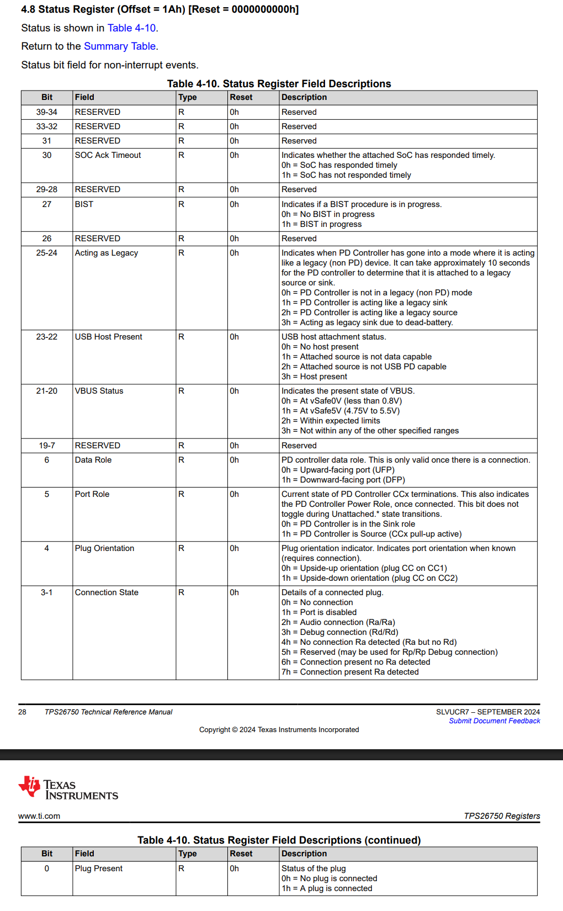
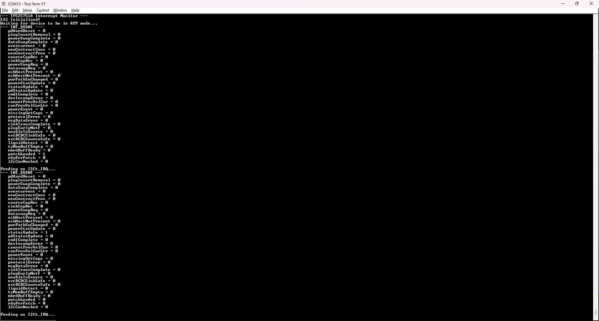

<picture>
  <source media="(prefers-color-scheme: dark)" srcset="https://www.ti.com/content/dam/ticom/images/identities/ti-brand/ti-logo-hz-1c-white.svg" width="300">
  
</picture>

# TPS25751A Interrupt Monitor

## Summary

This simple code example is a diagnostic tool used to continuously monitor the interrupts on the [TPS25751A](https://www.ti.com/product/TPS25751A) and print out via a UART terminal the ones that trigger on a falling edge of the I2Ct_IRQ line. This code example uses the [MSPM0G3507](https://www.ti.com/product/MSPM0G3507) microcontroller in combination with FreeRTOS/TI-Drivers to manage the communication and display relevant information on a terminal using UART. 

## Hardware Configuration

The [TPS25751AEVM](https://www.ti.com/tool/TPS25751EVM) is used with the [LP-MSPM0G3507 LaunchPad](https://www.ti.com/tool/LP-MSPM0G3507). The I2C lines are connected via jumper wire with the MSPM0G3507 being the I2C controller and the TPS25751A being the I2C peripheral device. The connection configuration can be seen below:

##### **[TPS25751AEVM](https://www.ti.com/tool/TPS25751AEVM)**


In this configuration, the following connections are made:

- GND of the TPS25751A is connected to any available GND pin of the LP-MSPM0G3507

- I2Ct_SCL of the TPS25751A is connected to PB2 of the LP-MSPM0G3507

- I2Ct_SDA of the TPS25751A is connected to PB3 of the LP-MSPM0G3507

- I2Ct_IRQ of the TPS25751A is connected to PB24 of the LP-MSPM0G3507

## Build Instructions

Please refer to the build instructions included in the root of the examples repository [README.md](https://github.com/TexasInstruments/usb-pd).

This code example was built using the [MSP M0 SDK](https://www.ti.com/tool/MSPM0-SDK) **v2_06_00_05** and [Code Composer Studio](https://www.ti.com/tool/CCSTUDIO) **v20.4.0.13**. This code example leverages TI-Drivers for UART logging and I2C communication as well as the FreeRTOS kernel included in the MSPM0 SDK.

## Usage

Note that the device configuration file that is used to setup the TPS25751AEVM has been checked into this repository in the [config.json](https://github.com/TexasInstruments/usb-pd/blob/main/examples/tps25751a/mspm0g3507/tps25751a_interrupt monitor/config.json) file. You can use this JSON file with the [USB Configuration Tool](https://dev.ti.com/gallery/view/USBPD/USBCPD_Application_Customization_Tool/) as described in the [TPS25751AEVM's User's Guide](https://www.ti.com/lit/pdf/SLVUDL4).

The configuration file above has the PD Hardreset, Plug Insert or Removal, Status Updated, PD Status Updated, Patch Loaded, and Ready for Patch interrupts enabled in the interrupt mask register (0x16). Refer to the [TPS25751A Technical Reference Manual](https://www.ti.com/lit/pdf/SPMU379) for detailed information about available interrupts and how to enable them.

This code example takes the register structures of the TPS25751's host interface (as described in the [TPS25751A Technical Reference Manual](https://www.ti.com/lit/pdf/SPMU379)) and represents them in a standard C header file. The status register, for example:



... is mapped pragmatically to a header file as seen below from **[tps25751.h](https://github.com/TexasInstruments/usb-pd/blob/main/common/tps25751.h)**:

```c
/* Status Register */
typedef union 
{
    uint8_t bytes[6];
    struct __attribute__((packed))
    {
        uint8_t  numOfBytes         : 8;
        uint8_t  plugPresent        : 1;
        uint8_t  connectionState    : 3;
        uint8_t  plugOrientation    : 1;
        uint8_t  portRole           : 1;
        uint8_t  dataRole           : 1;
        uint16_t reserved0          : 13;
        uint8_t  vbusStatus         : 2;
        uint8_t  usbHostPresent     : 2;
        uint8_t  actingAsLegacy     : 2;
        uint8_t  reserved1          : 1;
        uint8_t  bist               : 1;
        uint8_t  reserved2          : 2;
        uint8_t  socAckTimeout      : 1;
        uint16_t  reserved3         : 9;
    } bits;
} tStatusRegister;
```

Using these header files, this code example keeps a "shadow" copy of the device's configuration in RAM and shows how to keep track of the device's interrupt events registers. Note that although the header file referenced above is named for the [TPS25751](https://www.ti.com/product/TPS25751), the register set and bit definitions will be identical for the [TPS25751A](https://www.ti.com/product/TPS25751A) used in this example.

In this code example, we setup the MSPM0 to listen for a falling edge interrupt on the I2Ct_IRQ line. This is done periodically throughout the code to prevent polling the I2C line and waiting for certain events to take place:

```c
        Display_printf(display, 0, 0, "\nPending on I2Ct_IRQ...");
        xSemaphoreTake(xSemaphore, portMAX_DELAY);
```

The interrupt handler for the interrupt GPIO can be seen below:

```c
void interruptEventCallback(uint_least8_t index)
{
    xSemaphoreGiveFromISR(xSemaphore, NULL);
}
```

After booting up, the device periodically reads the MODE register and waits for it to return that the device is in APP mode:

```c
    /* Waiting for the device to be in APP mode  */
    modeReg.mode = 0;
    addrReg = TPS25751_MODE_REG;
    Display_printf(display, 0, 0, "Waiting for device to be in APP mode...");
    while (modeReg.mode != TPS25751_MODE_APP)
    {
        vTaskDelay(10 / portTICK_PERIOD_MS);

        i2cTransaction.writeBuf   = &addrReg;
        i2cTransaction.writeCount = 1;
        i2cTransaction.readBuf    = &modeReg;
        i2cTransaction.readCount  = sizeof(tModeRegister);

        I2C_transfer(i2c, &i2cTransaction);
    }
```

After the device in in application mode, the code example immediately checks the interrupt status by querying the INT_EVENT register:

```c
    /* Reading out interrupt */
    addrReg = TPS25751_INT_EVENT_REG;
    i2cTransaction.writeBuf = &addrReg;
    i2cTransaction.writeCount = 1;
    i2cTransaction.readCount = sizeof(tIntEventRegister);
    i2cTransaction.readBuf = &curTriggeredIntsReg;

    if (I2C_transfer(i2c, &i2cTransaction) == false)
    {
        /* In this case we NAKed. Normally we would fault out here, but it is possible 
            that the device just isn't powered up so let's delay for 100ms and then
            try again */
        vTaskDelay(100 / portTICK_PERIOD_MS);
        continue;
    }
```

After reading out the event register, the MSPM0 immediately clears the pending events and then prints out the contents of the INT_EVENT register as seen below in the terminal print out:


## Licensing

See [LICENSE.md](https://github.com/TexasInstruments/usb-pd/blob/main/LICENSE)

---

## Developer Resources

[TI E2E™ design support forums](https://e2e.ti.com) | [Learn about software development at TI](https://www.ti.com/design-development/software-development.html) | [Training Academies](https://www.ti.com/design-development/ti-developer-zone.html#ti-developer-zone-tab-1) | [TI Developer Zone](https://dev.ti.com/)
